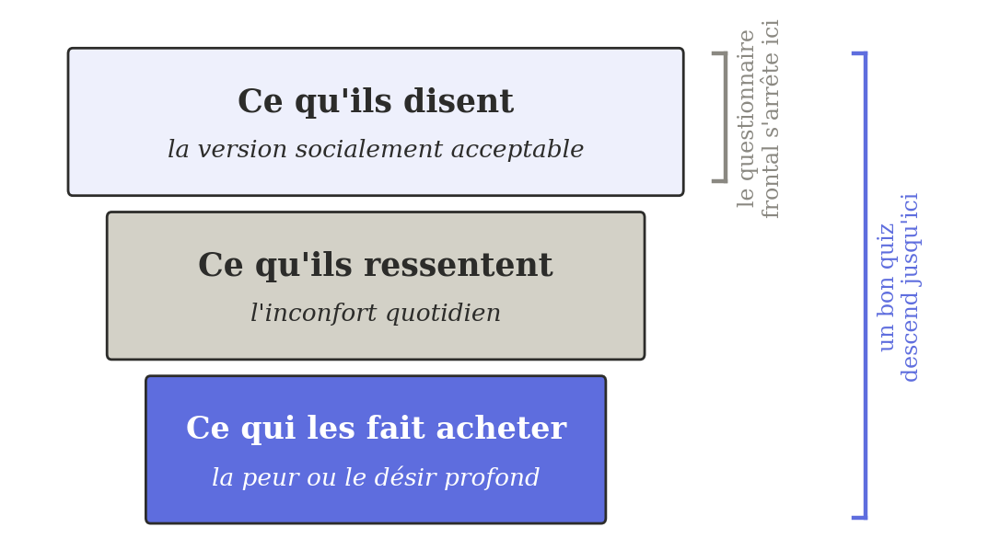
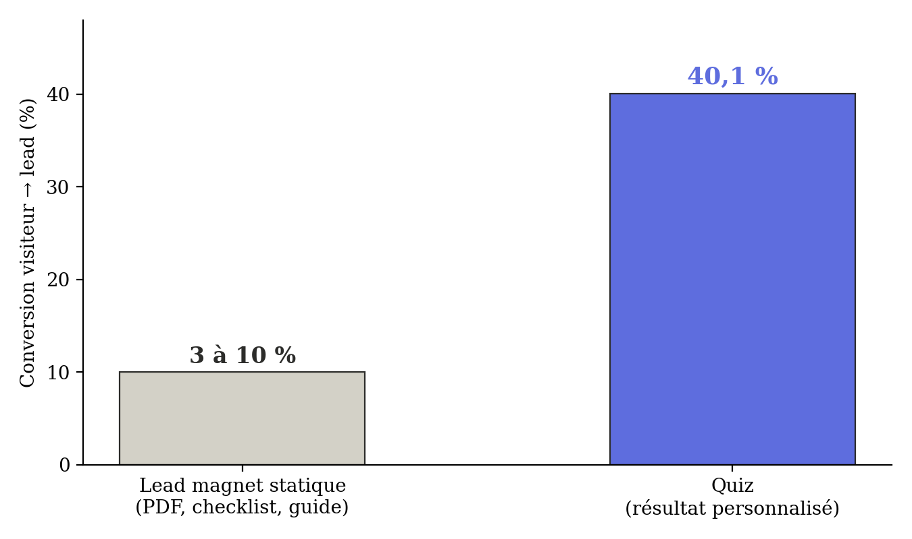
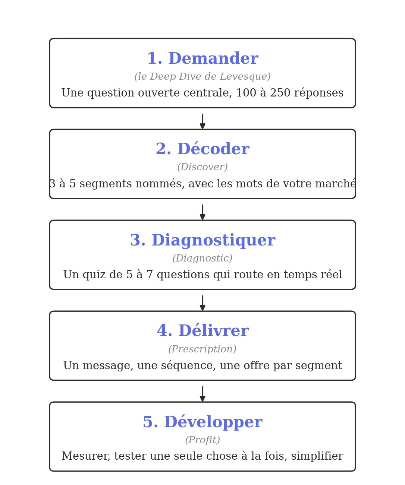
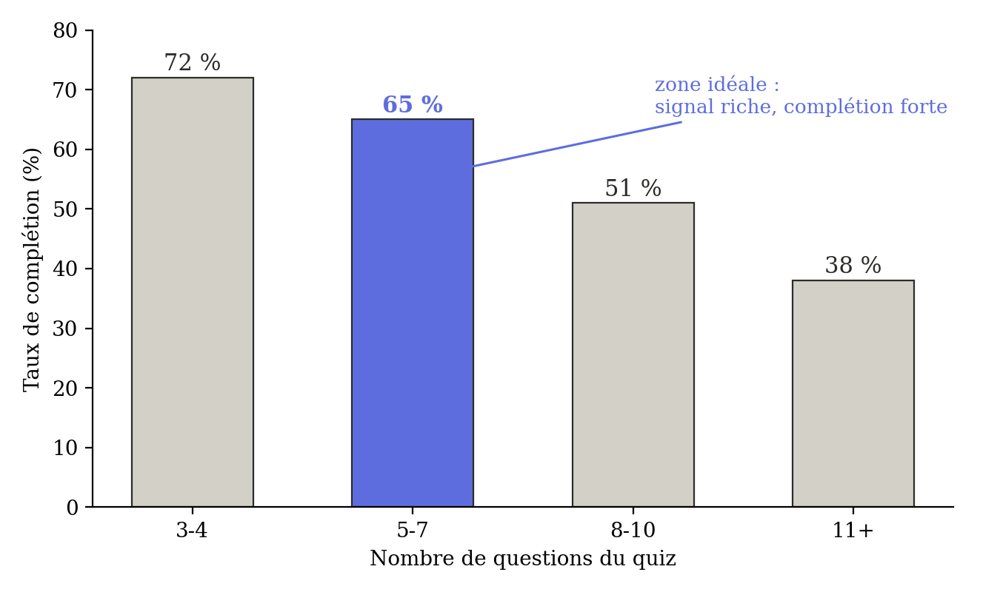
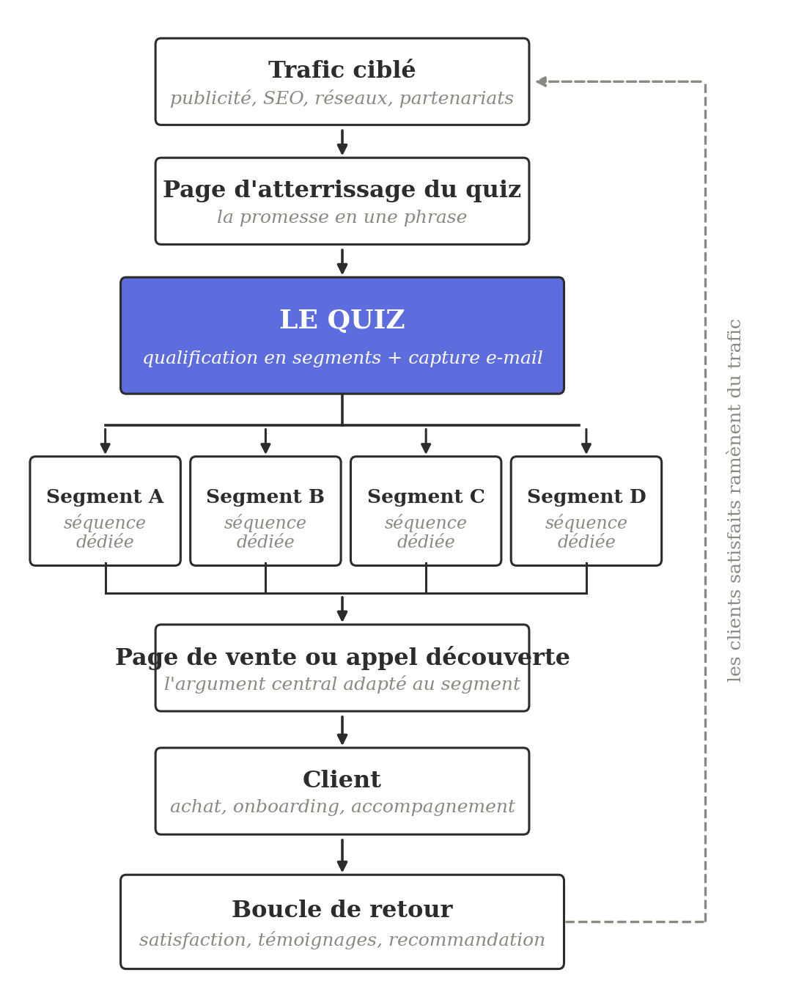

Just Ask.

Just Ask.

*The counterintuitive method for discovering what your prospects really want to buy, and selling it to them with a simple quiz*

The Ask Funnel, inspired by Ryan Levesque's Ask Method, applied to Systeme.io and modern solo businesses

**Bene Lagardette**

Founder of Tiquiz and Tipote

Self-published, 2026

© 2026 Bene Lagardette. All rights reserved.

No part of this book may be reproduced, stored in a retrieval system, or transmitted in any form without the prior written permission of the author, except for brief quotations used in reviews or articles.

Inspired by the method developed by Ryan Levesque in his book *Ask: The Counterintuitive Online Formula to Discover Exactly What Your Customers Want to Buy* (Hay House, 2015, revised edition 2019). This book does not reproduce Ryan Levesque's content; it offers an application of the Ask Method to Systeme.io and modern solo businesses.

This book is an independent publication. It is not affiliated with, or endorsed by, Ryan Levesque or The ASK Method® Company. "ASK Method" is a trademark of The ASK Method Company.

Disclaimer: this book contains educational information about marketing. The results described are not a promise of earnings. The author is the founder of Tiquiz, a tool cited in this book; this conflict of interest is acknowledged and disclosed to the reader.

Self-published, Bene Lagardette

ISBN: 9798181266698

First edition: 2026

Contact: hello\@tipote.com

*To the solopreneurs who build alone,*

*but who should never stay isolated.*

You are holding this book because you have tried everything.

The free PDF downloaded by ten people, nine of whom you never heard from again. The five-point checklist your prospects download and then file straight into the trash without reading it. The newsletter you pour your best ideas into every week, for an open rate that keeps slowly drifting down.

You have the right product. You have the expertise. You even have results to show. But you are propping up a system that demands more and more effort for thinner and thinner returns.

This book is not a theory manual. It is the method Ryan Levesque documented in 2015 in *Ask*, after testing and refining it across 23 different niches to generate more than $100 million in sales¹. A method that comes down to this: stop guessing what your prospects want, and ask them instead. Not with a satisfaction survey. With a real, structured conversation that engages them and gives you exactly the information you need to sell them exactly what they are looking for.

Ten years later, this method has not aged a day. It has gained a new dimension thanks to artificial intelligence, which lets you deploy it in minutes rather than weeks.

And it remains badly underused among modern solo businesses, where most entrepreneurs keep handing out PDFs that no one reads.

## Who is Ryan Levesque

Ryan Levesque has an unusual background for a marketer. An Ivy League graduate in neuroscience, he started his career on Wall Street before moving to Shanghai to understand Asian markets. In 2008, with a $450 laptop, he launched an online publishing business in the orchid niche².

That niche may sound trivial. It is not. It is precisely because he worked in such a narrow niche that Ryan Levesque discovered what he now calls the Ask Formula: with no large advertising budget, no existing audience, and no network, he had to figure out how to sell to people he did not know, while understanding exactly what they wanted.

His method consists of asking his audience a series of structured questions, sorting respondents into buckets based on their answers, and then serving each bucket an offer tailored to its specific problem.

He then replicated the method across 22 other niches, from B2B to B2C, from e-commerce to services. His book *Ask*, published in 2015 by Hay House, was named Best Marketing Book of the year by Inc. Magazine and the second book budding entrepreneurs should read by Entrepreneur Magazine³. A revised edition was published in 2019 by the same publisher.

His company, The ASK Method Company, has been named seven times to the Inc. 5000 list of the fastest-growing companies in America⁴.

## Why this book applies the Ask Method to Systeme.io and modern solo businesses

Ryan Levesque wrote *Ask* in 2015. The examples he uses are dated. The tools he recommends require a stack of separate platforms wired together. And 2026 looks nothing like 2015.

Several realities of how solo businesses actually operate today change how the method gets applied:

First, most solopreneurs work alone, on a tighter budget than a large team, and many of them run their entire business on Systeme.io as their all-in-one platform. A method that requires Infusionsoft, ConvertKit, LeadPages, and three other tools wired together cannot be implemented as-is.

Second, when you are a solo business, you cannot afford to bucket your audience badly, because you cannot run tests on 10,000 people to optimize. Every lead counts. The method has to be adjusted to work at a smaller scale, with less volume.

Third, artificial intelligence has transformed how the method gets executed. What Ryan Levesque took six weeks to set up can be generated in six minutes in 2026. That changes what is worth testing, and what becomes possible for a single entrepreneur working alone.

## Who this book is for

You are a solopreneur, a freelancer, a coach, a consultant, a trainer, or you run an online business (e-commerce, info-product, paid community). You want to capture more qualified leads and sell more, with a system that does not require you to become an expert in advertising or automation.

You do not need to have read Ryan Levesque's book to understand this one. I will introduce each concept of the method at the moment it becomes necessary, with its figures and its cases. If you have already read *Ask*, this book will serve as a contemporary toolkit, calibrated for how solo businesses actually run today.

The technical level required is minimal. You need to know how to click, copy, and paste. That is all. Every example is backed by figures and sources. Every recommendation is testable with the tools available on the market today.

## Why I am writing this book now

Let me be clear about where I stand, so you know who is talking.

I have used Systeme.io since 2020. I have watched hundreds of free PDFs go by, sales funnels of varying sophistication, and email sequences that all end up looking the same. I have watched solopreneurs pour enormous amounts of time into building things that bring back almost nothing, because the underlying mechanism was wrong.

I discovered Levesque's method because my own marketing was not getting the results I wanted. I was doing what everyone else was doing: the newsletter, the free PDF, the LinkedIn post. With conversion rates that never rose above the usual. When I tested the quiz mechanism for the first time, in 2023, I watched my capture rate jump from 4% to 18% on the same traffic. Not a little better. Four times better.

I built Tiquiz because the tools that existed did not fit. Too expensive (ScoreApp at $60/mo is a budget few solopreneurs can take on), not connected to Systeme.io (so you needed Zapier or Make on top), or not suited to the speed of creation you need when you are doing everything yourself.

But Tiquiz is just a tool. Without the method, the tool is useless. And the method is Ryan Levesque's Ask Method, applied to the way solo businesses actually work today. That application is the reason this book exists.

I am writing it because I want solopreneurs, the ones reading me and the ones I have not met yet, to have access to the same mechanism that has been transforming customer acquisition in the United States for ten years. Not a watered-down version, not an over-simplified one. A serious, sourced version, adapted to what actually works today.

As for my own revenue: this book will cost you less than $15 on Amazon. I do not make much per word. What interests me is that you apply the method. If you find Tiquiz useful along the way, great. If not, pick another tool and do the work. The goal is for you to stop pouring your time into marketing that no longer pays off in 2026.

## How to read this book

The book is structured in five parts, which answer five different questions.

**Part 1** explains why the classic "free PDF for everyone" marketing no longer works, and why the quiz method solves exactly that problem. This is the diagnostic part. If you are still hesitating to invest time in this approach, read it first.

**Part 2** details the five steps of the Ask Funnel, each one illustrated with recent figures and concrete cases. This is the methodological heart of the book.

**Part 3** covers concrete execution in 2026: which tools to use, how AI changes the work, and how to launch your first campaign in 30 days.

**Part 4** presents case studies backed by figures, some of them from Ryan Levesque himself, others from solo businesses.

**Part 5** supports you over the long run: the ethics of the practice, adapting to your specific sector, solving the typical problems, orchestrating the complete system, and the trends that are coming. This is the part that turns a successful launch into a durable pillar of your acquisition.

Finally, the **appendices** gather the ready-to-use templates. And if you want to put them into practice without copying anything by hand, everything this book describes (quiz, Systeme.io tags, AI generation) can be built directly in Tiquiz. Free trial: **tipote.fr/tiquiz**.

At the end of each major part, you will find a **Mini-Quiz** that lets you apply what you have just read to your own situation. These Mini-Quizzes are not decorative. They are built exactly like a real marketing quiz: they bucket you, diagnose you, and give you a concrete prescription based on your profile. You can fill them out in pen in the book, or scan the QR code alongside to take them online. The online version saves your profile and emails you a recap of your results.

This is exactly what you are going to learn to do for your own business.

### A note on the figures

Every figure cited in this book comes from a public source that I name each time. You will find the full references in footnotes and in the bibliography at the end of the book. When a figure comes from Ryan Levesque himself, I say so. When it comes from a third-party study, I specify which one and its year of publication.

I will never ask you to take my word for anything. You can verify every source.

A point of honesty, because it matters: throughout the book you will meet Sophie, a career-change coach, and Antoine, a B2B SaaS trainer. These are **composite teaching cases**: characters built from several real situations, with figures representative of what the method produces when it is applied with discipline. They do not refer to any identifiable client. The case studies in Part 4, on the other hand, are real and sourced, and when a case is composite, I say so.

### The test I propose

Read the preamble and Part 1. Take Mini-Quiz 1. If after that you are still convinced the free-PDF method is enough for your business, close the book. You will have given me an hour and I will have spared you the rest.

But if something in Part 1 resonates with what you are living today, the fatigue, the feeling that you give too much for what you get back, the impression that your email list is not sleeping but dead, then keep going. The quiz method can genuinely change what you get out of your work.

> ¹ Source: AskMethod.com / The ASK Method Company, "Why Ask Method" page.
>
> ² Source: Levesque, R. (2015). *Ask: The Counterintuitive Online Formula to Discover Exactly What Your Customers Want to Buy*. Hay House Inc. Introduction.
>
> ³ Sources: Inc. Magazine, Best Marketing Book of 2015. Entrepreneur Magazine, Must-Read Books for Budding Entrepreneurs.
>
> ⁴ Source: Inc. 5000, lists 2017 to 2023.

# Part 1: Why the classic "free PDF for everyone" marketing no longer works

I told you in the preamble: in 2023, I replaced my PDF opt-in page with a quiz, on the same traffic, and my capture rate jumped from 4% to 18%. What I have not told you yet is *why* it worked. This first part explains it, and dismantles along the way the beliefs that still weigh down a lot of marketing.

## Chapter 1. The myth of the single persona

Ask a marketer what their ideal customer looks like. They will describe an avatar. A name, an age, an occupation, a main pain point, a secret dream. A character sheet they spent three hours filling out during a marketing training, and that they keep in a folder labeled "Strategy."

That sheet is useful for framing your communication. It is far less useful for selling.

Because in real life, your ideal customer does not exist in a single copy. Your market is made up of several buckets, each with its own concerns, its own level of maturity, its own objections. And when you communicate with a single generic message, you speak to everyone at once, which is to say no one in particular.

### What Ryan Levesque says about the avatar

Ryan Levesque documented this observation as early as the first version of his book. Analyzing the answers of more than 100,000 people across his 23 niches, he discovered that in most markets, **there are between 3 and 5 distinct buckets** within a single, seemingly homogeneous audience¹.

Take a niche as narrow as his at the start: orchid enthusiasts. At first glance, a single avatar: a gardening lover, somewhat older, with a greenhouse or a sunroom. Levesque discovered that in reality, this market held five very different buckets:

-   Those who just want to keep their orchid from dying

-   Those who want to get an orchid that has stopped blooming to bloom again

-   Those who collect rare species

-   Those who want to grow orchids from seed

-   Those who want to turn it into a business

Five buckets. Five radically different problems. And a free PDF like "10 tips for growing your orchids" that does not really speak to any of them.

This logic shows up in absolutely every niche Levesque tested, from B2B marketing to parenting coaching, from nutrition to renewable energy.

### What this looks like in your case

Imagine a career-change coach who offers her services to burned-out managers. Her "official" avatar: Sophie, 38, a manager at a large company, two children, feels drained, looking for meaning.

If you dig into her real audience, you will probably find:

-   Sophies who genuinely want to change careers

-   Sophies who want to change companies but not careers

-   Sophies who want to go out on their own

-   Sophies who want to drop to part-time without changing roles

-   Sophies who just want to understand why they cannot take it anymore

Five Sophies. Five different solutions. Five different messages.

When our coach offers a PDF titled "7 signs your career no longer fits you," she is indeed speaking to all the Sophies. But she offers no specific answer to any one of them. Each one reads the PDF thinking "interesting, but it is not really my situation," and moves on.

### Why the single avatar persists even though it no longer works

If the single avatar worked so badly, it would have disappeared from marketing trainings long ago. Yet it remains the most-taught tool in mainstream marketing courses. There are three reasons for this.

First, because it is simple to teach. Filling out an avatar sheet takes thirty minutes in a training. Building a bucketing system with five buckets takes five days and demands real strategic thinking. Trainings sell what is easy to consume.

Second, because ten years ago, the single avatar worked well enough. The inbound marketing market was young, few people offered free content, and capturing an email with a generic PDF was a successful technical feat in itself. The problem was not the precision of the message; it was access to the audience.

Third, because many marketers have not read Ryan Levesque or his successors. Mainstream literature on marketing segmentation remains largely inspired by university textbooks from the 1990s. This method of bucketing by survey is known to only a very narrow fraction of the professional market.

### The cost of missing bucketing

To grasp what you lose by not bucketing, it helps to have a number.

The *Quiz Conversion Rate Report 2026* published by Interact, based on more than 80 million leads captured through its tools, shows that **the conversion rates of a bucketing quiz hover around 40.1%**, compared with 3% to 10% for a generic PDF downloaded in exchange for an email². That is a difference of a factor of 4 to 10.

This difference does not come from the magic of the quiz. It comes from the precision of the message. When you bucket your prospects, you can serve them content, an email, an offer that matches their exact situation. They respond. They open. They buy. Not because the quiz is pretty, but because they finally feel that someone is talking to them.

And this difference does not show up only at the opt-in. Kyleads' comparative analyses of B2B and B2C quiz funnels point in the same direction: **leads from a quiz convert into customers far better than leads from a PDF**, because they enter your funnel with a clearer intention and a richer context³.

### What to take away

The single avatar may have helped you start your business. It is no longer enough to grow it.

Your market holds several buckets, each with its own problem. The job of your marketing is not to speak to them as if they were identical, but to tell them apart from one another and to serve each one the answer that fits.

That is exactly what the quiz method lets you do, with a setup effort measured in hours rather than weeks.

> **WORTH SHARING:** *a message that speaks to everyone sells to no one.*
>
> ¹ Source: Levesque, R. (2015). *Ask*. Hay House. Chapter on the Deep Dive Survey and the buckets.
>
> ² Source: Interact. (2026). *Quiz Conversion Rate Report 2026*. tryinteract.com/blog/quiz-conversion-rate-report.
>
> ³ Source: Kyleads. (2026). *Quiz Funnels vs Lead Magnets in 2026: Which Converts Better*. kyleads.com/blog.

## Chapter 2. What your prospects will never tell you directly

If you have ever tried to interview your prospects to understand what they really want, you have probably made the following observation: half of what they tell you does not match what they end up buying.

It is not that they are lying. It is that they themselves do not know what they really want.

This is one of Ryan Levesque's central discoveries, and one of the most counterintuitive. The quiz method rests on a fundamental insight: **people will never tell you directly what they want to buy, because they do not know it themselves**.

### The gap between what people say and what they buy

Ask an overweight prospect what they are trying to fix. They will tell you they want to lose 20 pounds. Ask the question a different way and they will talk about fatigue, acid reflux, the difficulty of recognizing themselves in the mirror. Ask a third question and they will tell you they are afraid their spouse will leave them because they have let themselves go.

Which of these three needs are you going to address in your offer?

If you stay on the surface ("I want to lose 20 pounds"), you sell them a generic diet program. They have already tried three. They will abandon yours like the others.

If you go down to the second level ("the fatigue, the acid reflux"), you speak to the daily discomfort that excess weight creates. You touch something more concrete, but it is still a symptom.

If you go down to the third level ("I am afraid my spouse will leave me"), you touch the visceral fear. That is where the real buying motivation lives. It is also the level the prospect will not answer at if you ask them directly "why do you want to lose weight."

Ryan Levesque calls this phenomenon the **"people don't know why they buy" principle**. It is not that they lie on purpose. It is that there are three layers of speech:

-   What they say (the socially acceptable version)

-   What they feel (the daily discomfort)

-   What makes them buy (the deep fear or desire)

And a head-on questionnaire only triggers the first layer.

*Figure 2. The three layers of speech: a head-on questionnaire stops at the surface, a good quiz goes all the way down to the buying motivation.*

### What cognitive science has confirmed since

This observation is not a marketing hunch. It has been widely validated by research in behavioral psychology and neuroscience since the 2000s.

Daniel Kahneman, winner of the 2002 Nobel Prize in Economics, demonstrated in *Thinking, Fast and Slow* (2011) that the majority of our purchase decisions are made by "System 1": fast, emotional, unconscious. "System 2," rational and conscious, intervenes *after* the decision, to justify it¹.

This means that when you ask a prospect why they want to buy something, it is their System 2 that answers. But System 2 is not the one that made the decision. So you collect a post-hoc justification, not the real reason.

To reach the real reason, you have to bypass System 2. That is what the quiz method does, without putting it that way.

### How a quiz bypasses this trap

A well-built quiz does not ask the prospect what they want. It asks them concrete, factual, seemingly innocuous questions, whose aggregated answers **draw a profile** that you then interpret.

Let us go back to the overweight prospect. Instead of asking "why do you want to lose weight," a well-designed quiz will ask, for example:

-   At what time of day do you eat the most?

-   How many hours do you sleep on average?

-   Do you sometimes eat even when you are not hungry?

-   What physical activities have you given up over the past two years?

-   What would make you say you have "succeeded" in 6 months?

None of these questions directly asks "why do you want to lose weight." All the answers, taken together, let you position this prospect precisely: emotional eating, fatigue, sedentary lifestyle, loss of body confidence. The profile emerges from the data, not from declarations.

And above all, **the prospect themselves discovers things about their situation** while answering the questions. When the quiz delivers their result ("you belong to the emotional eaters who have lost their rhythm profile"), they recognize themselves. They feel they have been understood better than they understood themselves. At that point, you no longer need to convince them that your offer is made for them. They are the ones coming to ask you for it.

### The trigger for engagement: self-disclosure

There is a precise psychological mechanism behind this dynamic, studied in particular by researchers Diana Tamir and Jason Mitchell at Harvard, who published a study in 2012 in the journal *PNAS* (Proceedings of the National Academy of Sciences) showing that **talking about oneself activates the same brain circuits as receiving a reward (money, food)**².

In other words, the human brain finds pleasure in talking about itself. And the more an experience lets someone reveal themselves to themselves, the more pleasure they take in it, and the more they engage.

A PDF triggers none of these circuits. A quiz does. That is why quiz completion rates average around 65%, according to Interact's data on more than 80 million leads, while the majority of downloaded content is never read in full³.

### What to take away

Your prospects will not tell you what they really want. Not out of bad faith: out of normal human functioning. If you ask them the question head-on, you collect a filtered version that does not help you.

A well-built quiz bypasses this filter. It asks concrete questions, cross-references the answers, and brings a profile to the surface. The prospect recognizes themselves in the profile and feels understood, which predisposes them to buy what you offer next.

This is precisely the mechanism you are going to learn to set up in the second part of this book.

> **WORTH SHARING:** *your prospects are not lying to you. They do not know themselves. A good quiz makes the introductions.*
>
> ¹ Source: Kahneman, D. (2011). *Thinking, Fast and Slow*. Farrar, Straus and Giroux.
>
> ² Source: Tamir, D. I., & Mitchell, J. P. (2012). Disclosing information about the self is intrinsically rewarding. *Proceedings of the National Academy of Sciences*, 109(21), 8038-8043.
>
> ³ Source: Interact, *Quiz Conversion Rate Report 2026*. On the non-consumption of downloaded content: Demand Gen Report, *Content Preferences Survey*.

## Chapter 3. Why free PDFs convert less and less

When the free PDF arrived in marketing, around 2014 to 2016, it was a revolution. Capturing an email in exchange for a downloadable guide was a new, generous mechanism that turned invisible entrepreneurs into recognized experts.

Ten years later, the free PDF is no longer a revolution. It has become background noise. And background noise does not convert.

### The observation that changes everything

Run the test around you: of the PDFs downloaded in the last six months, how many were actually read? The honest answer almost always hovers around "almost none." Demand Gen Report's surveys (*Content Preferences Survey*) confirm it edition after edition: buyers accumulate downloaded content far faster than they consume it, and ask for shorter, more interactive formats¹. The download has become an archiving reflex, not an act of reading.

A large share of your prospects is therefore lost the instant you delivered your PDF. They are on your list, you are going to send them emails, they will not open them or will skim them, and you will think your funnel does not work.

The problem is not your funnel. It is the entry lead magnet that pre-engages no one.

### Why the PDF no longer pre-engages

There are three reasons for this.

**First reason: saturation.** Between pop-ups, ads, and newsletters, an internet user is offered dozens of lead magnets every week. Their inbox overflows with PDFs they never read. When you offer yours, you are competing not with your direct competition, but with their fatigue.

**Second reason: the effort of extracting value.** A 20-page PDF demands active effort from the prospect to get something out of it. Downloading it costs nothing. Reading and applying it takes 30 to 60 minutes. Most people prefer to add to their pile of unread PDFs rather than make the effort. The PDF becomes symbolically useful ("I downloaded a guide on this topic, I will get to it") without ever actually being consumed.

**Third reason: the absence of feedback.** When someone downloads a PDF, you know they downloaded it. You know nothing else. Not their level, not their specific concerns, not their urgency. You put them in the same email sequence as all the other downloaders. And they receive a message that is not addressed to them.

### What the recent figures say

The comparative data between quiz and PDF is conclusive.

Interact's annual report (*Quiz Conversion Rate Report*), built on more than 80 million leads generated through its platform, measures **40.1% average conversion into a lead for a started quiz**, a figure remarkably stable since 2013, compared with 3% to 10% for classic static lead magnets². Kyleads' comparative analyses confirm these orders of magnitude: 30% to 50% opt-in for quizzes, around 5% for downloadable guides³.

*Figure 3. Visitor to lead conversion rate: the quiz outclasses the static lead magnet by a factor of 4 to 10 (source: Interact, Quiz Conversion Rate Report).*

On the consumer B2C side, the comparisons published by interactive form vendors (Dashform in particular) report a gap that can reach **up to a factor of 10** in favor of the quiz⁴.

And the momentum is accelerating: according to DesignRush's *2026 Lead Generation Statistics* report, **83% of marketers consider interactive content more effective at capturing attention** than static content, and 78% plan to increase their investments in interactive experiences⁵.

These figures do not mean the PDF is dead. It keeps its place in certain very specific contexts (a highly technical B2B white paper meant for a professional buyer who genuinely needs it for their work). But as a tool for capturing a broad audience, its time has passed.

### The boomerang effect of the over-consumed PDF

There is another effect, more subtle, that marketers are starting to measure in 2026: the PDF gradually devalues the perception of your expertise.

When you offer a free guide that looks like 50 other free guides on the same subject (the 10-point lists, the checklists, the Canva-formatted ebooks), your prospect unconsciously files you in the "yet another marketer handing me a PDF to get my email" category. You become interchangeable.

A quiz, because it is rare and delivers a personalized result, does the opposite. It positions you as someone who takes the trouble to understand your prospect before speaking to them. It sets you apart.

This positioning effect is hard to quantify precisely, but it overlaps with what studies on interactive content have been measuring for years: a large majority of marketers find that **interactive content captures attention and differentiates the brand** far better than static content⁶.

### What to take away

The free PDF was an excellent tool between 2014 and 2018. It no longer is in 2026, because its rarity has disappeared, because users no longer consume it, and because it generates no usable signal about the prospect who downloads it.

The quiz solves all three problems at once: it is still rare in the ecosystem, its engagement mechanism (self-disclosure) makes it addictive, and it delivers a usable profile that you can use for the rest of your commercial relationship with the prospect.

> **WORTH SHARING:** *a PDF tells you it was downloaded. A quiz tells you who did it, why, and what to offer them.*

Before moving on, take a few minutes to apply these first three chapters to your own situation. The Mini-Quiz that follows helps you do that.

> ¹ Source: Demand Gen Report. *Content Preferences Survey* (2023 and 2024 editions). demandgenreport.com.
>
> ² Source: Interact. (2026). *Quiz Conversion Rate Report*. tryinteract.com/blog/quiz-conversion-rate-report.
>
> ³ Source: Kyleads. *Quiz Funnels vs Lead Magnets: Which Converts Better*. kyleads.com/blog.
>
> ⁴ Source: Dashform. (2026). *Quiz Funnels vs Static Lead Magnets*. getaiform.com/blog.
>
> ⁵ Source: DesignRush. (2026). *2026 Lead Generation Statistics: Benchmarks, AI Trends & Revenue Growth*. designrush.com.
>
> ⁶ Source: Content Marketing Institute, *B2B Content Marketing Benchmarks, Budgets, and Trends*; and Ion Interactive, studies on interactive content.

## Mini-Quiz 1: What is your real capture problem today?

> You can answer directly in the book by checking your answers, or scan the QR code alongside to take it online. The online version saves your profile, emails you a recap, and gives you access to additional resources.
>

**Online version:** <https://quiz.tipote.com/q/quiz-1>

### Question 1. When a prospect downloads your lead magnet, what do you do next?

-   **A.** I add them to my main newsletter, like all my other contacts

-   **B.** I send them an email sequence identical to the one all other downloaders receive

-   **C.** I would like to bucket them, but I do not know how to do it concretely

-   **D.** I have no sequence at all, I send them my sales emails when I have some

### Question 2. How many times a month do you receive a message like "your PDF really helped me, I want to know more"?

-   **A.** Regularly, several times a week

-   **B.** A few times a month

-   **C.** Very rarely, maybe once or twice a quarter

-   **D.** Never

### Question 3. Of the last 100 prospects who downloaded your lead magnet, do you know how many became customers?

-   **A.** Yes, I track each conversion individually

-   **B.** Roughly yes, but I do not have the detail

-   **C.** No, I just know roughly how much I sold over the period

-   **D.** No, I do not measure

### Question 4. How many different avatars do you think you have among your prospects?

-   **A.** Just one, I have a very clear avatar

-   **B.** Two or three, I have never really dug into the question

-   **C.** Probably several, but I would not be able to name them

-   **D.** I do not even have a defined avatar

### Question 5. If you had to describe your prospects' main problem in one sentence, you would talk about…

-   **A.** A very precise, named situation

-   **B.** Several possible situations depending on the profile

-   **C.** A general pain (lack of time, fatigue, frustration)

-   **D.** You would not be able to answer without thinking about it for a long time

### Your results

**Count your answers by letter:**

A: \_\_\_ B: \_\_\_ C: \_\_\_ D: \_\_\_

**Profile 1: The Architect (mostly A)**

*You have built the machine. It runs. But it treats everyone the same.*

You have already put the basics in place: a defined avatar, a sequence in place, conversion tracking. Your problem is not the absence of a system, it is the insufficient yield of the existing system.

**Diagnosis:** you treat your prospects as a homogeneous group when they are not. Your single avatar masks the sub-buckets that have different needs and that you handle the same way.

**Immediate action:** read Part 2 of this book in full (the five steps of the Ask Funnel), then apply the Deep Dive Survey to your current list. You will probably discover that what you thought was a single avatar breaks down into 3 to 5 distinct buckets. That is where your conversion rates are going to take off.

**Profile 2: The Scout (mostly B)**

*You sense your market better than anyone. All you are missing is the structure.*

You have a business that runs, but you sense you are leaving opportunities on the table. You know more or less who your prospects are, but without precision.

**Diagnosis:** you are at the stage where the quiz method will bring you the most, because you already have an audience and data to work with, and you are just missing the tool to structure them.

**Immediate action:** do not jump straight to Part 3. Read Chapters 4 and 5 first (the Ask step and the Decode step), because that is where the bucketing work you are missing lives. The rest is easy once that is done.

**Profile 3: The Pathfinder (mostly C)**

*You know there is a problem. You are missing the system to fix it.*

You know there is a problem, but you do not know where to start. You may have a PDF that no longer brings in enough leads, or no clear system.

**Diagnosis:** you do not have a bucketing problem, you have a system problem. You need to start from a healthy base before refining.

**Immediate action:** read the book in full without skipping a chapter. Take all the Mini-Quizzes. The 30-day calendar in Chapter 11 is specifically designed for your profile. Follow it step by step, and you will have your first quiz online and your first qualified leads within the month.

**Profile 4: The Rebuilder (mostly D)**

*Everything is yet to be set up. That is a chance: you start with no bad habits to unlearn.*

No sequence, no measurement, no avatar, no clear answer. You may have a product or a service, but the capture system does not exist.

**Diagnosis:** the quiz method is made for you, but it cannot be your first project. You must first clarify what you sell and to whom, before setting up a system to sell it better.

**Immediate action:** read Chapter 4 (the Deep Dive Survey step) first. It is exactly the tool you need to clarify your positioning before anything else. Do not tackle the conversion mechanics until you have done that work.

> **You can also take this quiz online to receive your profile by email, with a detailed recap and the priority chapters to read based on your situation:**
>
> **[quiz.tipote.com/q/probleme-capture](https://quiz.tipote.com/q/probleme-capture)**
>
> Did one of these profiles make you think of someone? Share the quiz with them. This is exactly the recommendation mechanism that this book teaches you to build.
# Part 2: The Ask Funnel, the Five Steps

Ryan Levesque's method breaks down into five steps. For this book, I have condensed them into a formula you can remember, apply, and pass on: the **Ask Funnel**. Each step answers a precise question:

1.  **Ask** (Levesque's *Deep Dive*): what do my prospects really want?

2.  **Decode**: how do I group them into usable buckets?

3.  **Diagnose**: how do I build a quiz that identifies them in real time?

4.  **Deliver**: what offer do I match to each bucket?

5.  **Develop**: how do I iterate the system so it runs on its own?

### The Ask Funnel on one page

*Figure 1. The Ask Funnel: the five steps, from the open-ended question to the system that improves on its own.*

Take a photo of this page. It is the map of everything that follows, and the summary you will give to anyone who asks what this book is about.

You will see that these five steps follow on logically: each one produces the raw material for the next. If you skip a step, you work blind on the one that follows. If you run them in order, you build a system that no longer depends on your intuition but draws on data collected from your prospects themselves.

Each chapter follows the same structure: the concept explained simply, why it works, how to set it up step by step, a beginner example, an advanced example, and the trap to avoid. You can read it straight through or come back to it as you apply each step.

## Chapter 4. Step 1: Ask, the Deep Dive Survey

### What the Deep Dive Survey is

The Deep Dive Survey is the first questionnaire you send to your audience to understand its real concerns. Ryan Levesque calls it the *Deep Dive Survey*: literally, a "deep dive" into the heads of your prospects.¹ Everything else in the method is built on top of it.

Its defining feature: it contains only **one truly important question**, asked in open-ended form. Every other question serves to enrich the context of the answer to that central question.

Levesque's central question is:

> *"What is the single biggest challenge you're facing right now with [your topic], that you need help with?"*

This wording has been tested and refined across 23 different markets. Every word counts, and we are going to see why.

### Why it works

The classic approach to market research is to ask multiple-choice questions ("what is your income level," "how many children do you have," "are you more X or Y"). The problem: multiple choice gives you what you expect, never what you never suspected.

The open-ended question of the Deep Dive Survey gives you the opposite. It hands you your prospects' exact words, in their own language, with the nuances that no predefined list would ever have captured.

And there is an underlying psychological effect that few market studies exploit: when you ask someone to **put their problem into writing**, you force them to clarify it in their own head. That clarification makes them more engaged with your brand, because you have helped them understand something about themselves.

This effect has been documented by researchers in cognitive psychology. James Pennebaker, a professor at the University of Texas, published several studies as early as the 1990s showing that **the act of writing about personal concerns durably alters emotional engagement with the subject written about**.² This is what is known as the *writing-cure effect*. A prospect who has spent five minutes explaining their problem in your Deep Dive Survey is in a completely different mental state from a prospect who has just clicked a few boxes.

### The complete structure of a Deep Dive Survey

Here is how Ryan Levesque structures his, adapted for 2026.

**Question 1: The central question (open-ended)** *What is the single biggest challenge you're facing right now with [your topic], that you need help with?*

**Context questions (4 to 6 short, multiple-choice questions)**

-   How long have you been trying to solve this problem?

-   What have you already tried that did not work?

-   How much are you willing to invest to solve it?

-   What impact does this problem have on your daily life?

-   If you could snap your fingers, what would the ideal solution look like?

**Final question (open-ended, short)** *Is there anything else I should know about your situation?*

The whole questionnaire takes 4 to 7 minutes to fill out. That is short for a survey, but long for 2026, where the average form-completion time rarely exceeds 90 seconds. You trade a more modest volume for quality.

### How to set it up

**Step 1: choose your distribution channel.** If you have an email list, send the Deep Dive Survey to your subscribers and explain that you are preparing something for them. If you do not have a list, deploy it on your social media or in Facebook groups in your niche. Ryan Levesque started his by posting links in specialized forums.

**Step 2: build the form.** In 2026, several tools let you do this in under 30 minutes. Tally.so and Google Forms are enough for a beginner. Tiquiz can also host this kind of questionnaire with its Survey module. Whatever the platform, the key is that the open-ended question comes first (so that the multiple-choice questions do not frame the respondent's thinking) and that the form takes no more than 7 minutes.

**Step 3: aim for a minimum volume.** Ryan Levesque recommends **100 to 250 qualified responses** before you can draw usable conclusions.³ Below 50, you are working on noise. Above 500, you saturate. If you have a small list, that is the volume to aim for, not a perfect statistical representation.

**Step 4: analyze the open-ended responses.** This is where the value concentrates. You are going to reread the 100 to 250 answers to the central question and group the responses that resemble one another. You will discover that your prospects, without ever comparing notes, often use the same words and frame the same types of problems. These spontaneous groups are your first buckets.

### Beginner example: Sophie, career-change coach

Sophie is a career-change coach for burned-out executives. She has an email list of 600 people built over two years. Before using the method, she offered everyone a free 30-minute discovery call. Booking rate: 2%.

She sends a Deep Dive Survey to her list with the central question:

> *"What is the single biggest challenge you're facing right now in your professional life, that you need help with?"*

Out of 600 sends, she collects 142 detailed responses in two weeks. Reading them, she identifies 5 recurring themes:

-   38 people talk about **chronic exhaustion** and a **loss of meaning**

-   31 people talk about **conflicts with management** or a **toxic boss**

-   28 people want to **change careers but do not know toward what**

-   24 people want to **go out on their own but are afraid**

-   21 people talk about **difficulty balancing work and personal life**

Before her Deep Dive Survey, Sophie thought she had a single avatar ("the burned-out executive"). She discovers five sub-buckets, each with a different problem. And above all, she now has the exact words her prospects use, which she can reuse in her sales pages, her emails, her quiz.

### Advanced example: Antoine, B2B SaaS trainer

Antoine sells a course aimed at SaaS software vendors who want to improve their user onboarding. He sells on average 8 seats per launch at $1,800 per participant. He has a list of 4,200 people.

Antoine already knows he has several buckets. What he does not know is which ones are the most profitable to attack. He deploys a targeted Deep Dive Survey:

> *"What is the single biggest challenge you're facing right now in onboarding your SaaS users?"*

Plus four context questions:

-   Size of your team (1, 2-5, 6-20, 20+)

-   ARR of your SaaS (under 100k, 100-500k, 500k-2M, over 2M)

-   Stage of your product (MVP, traction, scale)

-   Who handles onboarding today?

Antoine collects 487 responses. Cross-referencing them with the context questions, he discovers:

-   Solo founders (1 person) mostly talk about lack of time

-   Teams of 2-5 talk about lack of methodology

-   Teams of 6-20 talk about difficulty scaling what used to work

-   Teams of 20+ talk about coordination between sales, customer service, and product

Four buckets with four radically different problems. Antoine is going to build four different quizzes behind them, and adapt his $1,800 course to each profile. He will also be able to sell premium offers to the 20+ teams (consulting at $15,000) that would never have bought from the general public.

### The art of the central question: 5 bad and 5 good wordings

This is the most important part of Chapter 4, and the most neglected by people setting up the method for the first time. Your central question is the pivot of everything that follows. A bad question gives you soft answers that bucket nothing. A good question gives you the exact language of your market and makes the buckets emerge almost on their own.

Here are 5 bad wordings that come up constantly among solopreneurs, and their good equivalents.

**Bad #1: "How can I help you?"**

This wording is too broad. The respondent does not know where to begin, so they often answer with a generality ("manage my time better," "earn more," "be calmer") that buckets nothing.

*Good version:* "What is the single biggest challenge you're facing right now with [your precise topic], that you need help with?"

The difference: the phrase "single biggest" forces prioritization, and the precise topic frames the scope. The respondent can no longer retreat into generality.

**Bad #2: "What are your goals for this year?"**

Annual goals are deliberate constructions (January 1 resolutions, strategic plans). They do not reflect the respondent's real daily concerns.

*Good version:* "What is the problem that costs you the most time or energy right now in your [activity]?"

The difference: you ask about what weighs on them now, not what they dream of for later. The respondent gives an answer anchored in their reality.

**Bad #3: "What are your biggest fears about [the topic]?"**

Too direct on the emotional level. The respondent closes up, because you are asking them to expose themselves before a relationship of trust is established.

*Good version:* "What is the moment or situation where you most often tell yourself 'I'll never manage this' or 'this isn't going to work for me'?"

The difference: you sidestep the frontal question by asking for a concrete situation. The respondent opens up more easily because they have a scene to describe, not an emotion to analyze.

**Bad #4: "What is stopping you from succeeding?"**

The word "succeeding" is too loaded. It triggers Kahneman's System 2 (rationalization) and cuts the respondent off from their real concerns.

*Good version:* "If you had to describe in one sentence what is wrong with your current situation, what would you say?"

The difference: you ask for a description, not an explanation. The respondent recounts what they are living through, not what they think about what they are living through.

**Bad #5: "On a scale of 1 to 10, how satisfied are you with...?"**

The quantitative scale kills the richness of the answer. You get back a number, not a story. A Deep Dive Survey is not a statistical market study.

*Good version:* "Tell me in a few sentences about the last time you tried to [solve the problem in your niche]. What happened?"

The difference: narrative opens up the field. The respondent gives context, details, implicit emotions. That is where you harvest the exact words to reuse in your quiz and in your marketing.

### The 3 criteria of a good central question

To check that your question is good before sending the Deep Dive Survey, run it through 3 criteria.

**Criterion 1: Specificity.** Your question must name a precise domain, not a vague one. "What is your challenge in marketing" is too vague. "What is your challenge in generating more qualified leads through your newsletter" is specific.

**Criterion 2: Temporal anchoring.** Your question must bring the respondent back to their present or a recent past, not a hypothetical future. "Right now," "these past 3 months," "the last time you," are temporal anchors that work. "In 5 years," "if you could," "ideally," are anchors that pull away from reality.

**Criterion 3: Qualitative openness.** Your question must call for a narrative, not a score. If the question can be answered with a number, a score, or a checkbox, it is not your central question. It is a context question.

A question that passes these 3 criteria will give you rich answers that turn into clear buckets.

### Example by niche

To anchor these principles, here is the central question worded for 5 different niches:

**Parenting coaching niche:**

> "What is the time of day you struggle most with your child right now, and what have you tried that didn't really work?"

**Organic cosmetics e-commerce niche:**

> "What is your main skin or hair problem right now, and what have you tested over the past 6 months without satisfaction?"

**Excel training for accountants niche:**

> "What is the Excel task that costs you the most time each month in your accounting work, that you can't manage to automate?"

**Career-change coaching niche:**

> "When you think about your current job, what comes up most often in your negative thoughts, and what have you done over the past 12 months to change it without success?"

**B2B SaaS (project management) niche:**

> "What is the most painful moment of your week in managing your current projects, and what solution have you tried that didn't deliver on its promises?"

You will notice that each wording contains a "precise current problem" part and a "what has already been tried without success" part. This combination is essential: it gives you both the pain and the context of what is not working, which will then let you position your offer as different from what failed.

### Trap to avoid

The trap of the Deep Dive Survey is putting **your marketer's questions** in it rather than your prospect's questions. Many entrepreneurs send a questionnaire with "what is your monthly marketing budget," "which channel do you prefer," "have you ever bought a similar product." These questions serve your thinking, not theirs.

The rule: **every question in the Deep Dive Survey must serve to understand your prospect**, not to validate a business hypothesis. If you catch yourself asking "how much are you willing to pay," you are no longer asking, you are already selling, and you destroy the quality of the answers.

> **WORTH SHARING:** the quality of your marketing depends less on what you say than on what you asked before you said it.
>
> ¹ Source: Levesque, R. (2015). *Ask*. Hay House. Chapter 3, "The Deep Dive Survey."
>
> ² Source: Pennebaker, J. W. (1997). Writing about emotional experiences as a therapeutic process. *Psychological Science*, 8(3), 162-166. And later publications.
>
> ³ Source: Levesque, R. (2015). *Ask*. Hay House. Chapter 4, on statistical thresholds.

## Chapter 5. Step 2: Decode, or how to turn hundreds of responses into usable buckets

### What bucketing is

You have your 100 to 500 responses. You have reread the open-ended answers. You have a hunch that several profiles are emerging. Now you need to formalize these profiles into **buckets** that are clear, named, and usable going forward.

A bucket, in Ryan Levesque's vocabulary, is a group of your audience that shares:

-   The same main problem

-   The same language for talking about that problem

-   The same expectation of a solution

-   The same level of buying readiness

You are not trying to classify your prospects by age, gender, or socioeconomic category. You are trying to classify them by **mental state in the face of their problem**. That is very different.

### The rule of 3 to 5 buckets

Ryan Levesque has a strong recommendation: **aim for between 3 and 5 buckets**, never more, never fewer.¹

Fewer than 3, and you reproduce the single-avatar problem: you are not really bucketing.

More than 5, and you fragment your market so much that you become unable to write a message that truly speaks to each bucket, and you burn through your resources on personalization.

This rule was validated across the 23 markets Ryan Levesque documented. It applies just as well today, perhaps even more so when your market is small and you have less volume to justify very fine fragmentation.

### How to go from 142 raw responses to 4 named buckets

Taking Sophie's example again, here is the step-by-step mechanic.

**Step 1: raw reading.** Reread all the answers to the central question in a single session, without taking notes. The goal is to let the recurring patterns emerge in your head without forcing them.

**Step 2: theme extraction.** On a blank document, list the themes that come up at least 5 times. Do not chase perfection, list everything.

**Step 3: grouping.** Group the similar themes. You will naturally eliminate duplicates and surface 3 to 7 main themes.

**Step 4: compression to 3-5 buckets.** Force yourself to compress. If you land on 7 themes, ask yourself which ones overlap enough to be merged. If you land on only 2, ask yourself whether one of them is not actually hiding two sub-buckets.

**Step 5: naming each bucket.** Give each bucket a name. Not a marketing name ("The Strategist," "The Pioneer"), but a **descriptive** name that sums up the bucket's central problem. Ryan Levesque calls this **the labels that sell**.

### AI in 2026: what changes

When Ryan Levesque wrote his book in 2015, analyzing open-ended responses took hours and demanded intellectual rigor. In 2026, you can paste your 200 open-ended responses into an AI tool like Claude or ChatGPT and ask it:

> *"Here are 200 answers to the question: 'what is your single biggest challenge in [topic].' Identify 4 to 5 main themes that come up, and for each theme summarize the central problem, the keywords used by respondents, and an estimate of the proportion of responses that fall under it."*

The AI will hand you in a minute what would have taken you a full day. Be careful of two things, though:

1.  **Read a sample of the responses yourself before using the AI**, to check that it is not hallucinating and that the themes it extracts match the reality of the corpus.

2.  **The AI does not do the naming work for you.** It can suggest names, but it is up to you to choose a name that resonates in your market. A bad name destroys what follows (your quiz will have a weak title, your sales pages will speak to no one).

### Beginner example: Sophie continues the bucketing

Sophie has her 5 raw thematic groups. She compresses them into 4 named buckets:

1.  **"The exhausted who want another life"** (exhaustion + loss of meaning), 26% of her list

2.  **"The stuck with a toxic boss"** (hierarchical conflicts), 22%

3.  **"The explorers without a heading"** (career change + fear of the leap), 36%

4.  **"The jugglers"** (balancing work and personal life), 16%

She kept 4 buckets out of the original 5, merging "change careers" and "go out on their own" into a single group ("the explorers without a heading"), because on rereading the responses she realized that the two subgroups used very similar language and had very similar expectations.

Each bucket now has a name that describes its problem and a percentage of the audience. Sophie knows where to concentrate her effort: her "explorers without a heading" make up more than a third of her list. That is where she will begin.

### Advanced example: Antoine refines the bucketing

Antoine, the B2B SaaS trainer, has more structured data (487 responses plus cross-referenced demographics). He identifies 4 buckets, which he cross-references with team size:

1.  **"The founder coding their own onboarding"**: teams of 1, problem of lack of time

2.  **"The team in search of a method"**: teams of 2-5, problem of no framework

3.  **"The team that has to scale"**: teams of 6-20, problem of moving from artisanal onboarding to industrialized onboarding

4.  **"The enterprise team that has to coordinate"**: teams of 20+, problem of silos between sales, customer service, and product

For each bucket, Antoine notes:

-   The percentage of respondents

-   The potential LTV (what price level he can sell at)

-   The main acquisition channel (where to find them)

-   The seasonality (what time of year they buy)

This cross-referenced grid lets him prioritize. He decides to attack bucket 3 first ("The team that has to scale"), because it combines the largest volume (32% of his list) and the highest LTV ($8,000+ in training plus consulting).

### The trap of marketing naming

The classic trap of bucketing is giving buckets names that look nice but describe nothing. You have probably seen typologies like "The Visionary / The Strategist / The Artisan / The Connector." These names sound good in a presentation. They are useless when you have to write a sequence email or draft a sales page.

The rule: **a bucket name must be able to serve as an email subject line**. If you cannot write "A message for [bucket name]" and have it mean something, your name is too abstract. Prefer "the exhausted who want another life" to "the transitioners," even if the first seems less elegant. The goal is not elegance, it is precision.

> **WORTH SHARING:** a good bucket name must be able to serve as an email subject line. The rest is decoration.
>
> ¹ Source: Levesque, R. (2015). *Ask*. Hay House. Chapter 5, "The Discover Phase."
## Chapter 6. Step 3: Diagnose, or how to build a quiz that truly qualifies

### The diagnostic quiz vs. the Deep Dive Survey: two different tools

This is where many entrepreneurs get it wrong: they confuse the Deep Dive Survey (a questionnaire to understand their market) with the diagnostic quiz (a public-facing tool that qualifies prospects in real time).

The Deep Dive Survey is a tool you use **once**, on your existing audience, to collect strategic data.

The diagnostic quiz is a tool you use **continuously**, on every new prospect, to route them into the right bucket and serve them the right next step.

The two don't look alike. The Deep Dive Survey has one central open-ended question and 4 to 6 context questions. The diagnostic quiz has **no open-ended questions at all**, and it delivers a **personalized result** to the respondent at the end.

### The structure of a diagnostic quiz that converts

According to data compiled by Interact in 2026, the highest-converting quizzes follow a common structure¹:

-   **An intriguing title** that promises a self-revelation

-   **5 to 7 questions** (never fewer, never more)

-   **3 to 5 options per question**, with no open-ended option

-   **3 to 5 results** that match the buckets you identified in Step 2

-   **An email capture right before the result**

-   **A personalized result** that describes the profile and proposes a next step

Each element has a precise logic.

### The quiz title: half the work

Your quiz title is what decides whether someone clicks or not. Ryan Levesque has documented three families of titles that work almost every time²:

**Family 1: "What type of X are you?"** Examples: "What type of entrepreneur are you?", "What type of coach matches your style?" This phrasing triggers the self-revelation curiosity we saw in Chapter 2.

**Family 2: "What is your dominant [X]?"** Examples: "What is your dominant limiting belief about money?", "What is your main energy leak?" This phrasing assumes the respondent has a dominant trait to discover, and that this trait explains their current situation.

**Family 3: "Discover your [profile/level/style] in [a short time]"** Examples: "Discover your entrepreneur profile in 3 minutes", "Discover your Meta ads maturity level in 90 seconds" This phrasing emphasizes speed, which lowers the perceived friction.

All three families share one thing: they promise **useful information about yourself**, in very little time. That's exactly what triggers the click.

### How many questions, how many results

Why 5 to 7 questions and not more?

Because beyond 7, the completion rate collapses. The Interact data gives the following ballpark figures:

-   3 to 4 questions: 72% completion

-   5 to 7 questions: 65% completion

-   8 to 10 questions: 51% completion

-   11+ questions: 38% completion³

*Figure 4. Completion rate by quiz length: 5 to 7 questions is the best signal/completion tradeoff (source: Interact).*

The sweet spot is 5 to 7: enough to gather quality signal, not so much that you lose half your respondents.

And why 3 to 5 results?

Because those are your buckets, identified in Step 2. If you have 4 buckets, your quiz will have 4 results. Not 3, not 5, not 4 "main" ones and 3 "secondary" ones. Exactly 4. Otherwise you blur the analysis.

### How each question points toward a result

Here's the underlying mechanic: each option of each question must be tied to one (and only one) bucket. At the end of the quiz, you count which bucket accumulated the most points, and that bucket becomes the result.

Let's go back to Sophie's example. She has 4 buckets, so 4 results. For each of her 6 questions, she offers 4 options. Each option corresponds to a bucket. If a respondent mostly checks the "directionless explorer" options, she gets the "directionless explorer" result.

This is what's called a **typed** quiz, or a personality-style quiz. It's the simplest mechanic to set up and the most effective for the majority of entrepreneurs. Other mechanics exist (score-based quizzes, conditional-branching quizzes), which we'll touch on briefly later.

### Beginner example: Sophie builds her quiz

Sophie is going to build her quiz from her 4 buckets. She uses Tiquiz, because she uses Systeme.io and leads are tagged automatically by bucket the moment they're captured.

**Title: "What's your real professional roadblock right now?"**

(Sophie chose this phrasing because her prospects told her during the Deep Dive Survey that they were trying to understand their situation, not solve it right away. The word "roadblock" came up 23 times in the open-ended answers.)

**Question 1: When you think about the work week ahead, what's the first feeling that comes up?**

-   A. A fatigue that hits before I even start (→ Burned Out)

-   B. Tension at the thought of facing my manager (→ Stuck)

-   C. Frustration at doing work that no longer feels like me (→ Explorers)

-   D. Guilt about not being present enough at home (→ Jugglers)

**Question 2: If you could change one single thing about your work life tomorrow morning, what would it be?**

-   A. The right to actually rest (→ Burned Out)

-   B. Changing teams or bosses (→ Stuck)

-   C. Doing work that would have meaning for me (→ Explorers)

-   D. Working fewer hours without losing income (→ Jugglers)

And so on across 6 questions. For each question, 4 options, each assigning a point to a bucket. At the end, Sophie captures the email and sends the personalized result with, for each profile, **a different sequence email** that matches the bucket exactly.

Her quiz completion rate at launch: 68%. Capture rate (email given) among those who finish: 78%. Compare that to the 4% of her old opt-in page with a free PDF. Her qualified list tripled in six months without her sending any more traffic. It's the conversion that exploded, not the traffic.

### Advanced example: Antoine builds a branching quiz

Antoine has a more sophisticated audience (technical directors, customer-service leads, SaaS founders). A classic personality quiz isn't enough, because his prospects want serious content, not a glossy-magazine mechanic.

He opts for a **conditional-branching** quiz: question 2 depends on the answer to question 1, question 3 depends on the previous two, and so on. It's technically more complex, but it allows for surgical qualification.

**Question 1: How big is your product team today?**

-   1 person (you) → branch A

-   2 to 5 → branch B

-   6 to 20 → branch C

-   20+ → branch D

Depending on the branch, question 2 changes. For branch C, for example:

**Question 2 (branch C): What's your main bottleneck in onboarding today?**

-   Lack of a documented framework

-   Difficulty training new people who join the team

-   Coordination between the sales team and customer service

-   Measuring success (what does a "successful" onboarding even look like?)

Antoine ends up with 4 very precise buckets at the end of the quiz, but with a smooth user journey thanks to the branches. It's more work to build, but it's unbeatable in B2B.

A note on the tooling here: branching like this is built with **Typeform** (its Logic feature) or **Outgrow**. **Tiquiz does not offer conditional branching, and that's by design**: the tool bets on simplicity, and a well-built typed quiz is enough in the vast majority of cases. For a beginner, I recommend starting without branches anyway: simplicity will always beat poorly executed sophistication.

### The UX that keeps people in: the 7 rules nobody follows

Everything we've covered so far concerns the content of the quiz: the questions, the options, the results. But content is only part of performance. Design and user experience matter just as much.

In 2026, **the vast majority of quizzes are started on a smartphone**. If your quiz isn't designed mobile-first, you lose half your respondents before they even reach the first question. Here are the 7 UX rules that make the difference between a quiz that keeps people in and a quiz that drives them away.

**Rule 1: One question per screen.**

Never show more than one question at a time, even if technically you can. The respondent needs to focus on a single thing. If several questions appear at once, the brain scans instead of answering, and the quality of the answers drops.

**Rule 2: No more than 4 options per question.**

Beyond 4 options, the respondent has to make a cognitive effort to compare them all. Above 6, many pick at random just to move on. Stick to 3 or 4 options per question. If you have more, split the question in two.

**Rule 3: The "next" button only appears once an answer is selected.**

This is a detail that changes everything. If the "next" button is always visible, the respondent can click it without answering, out of reflex. If the button only appears after an answer is selected, moving forward becomes a clear signal that engagement continues.

**Rule 4: A visible progress bar.**

The respondent needs to know where they stand. A progress bar or a counter ("Question 3 of 6") reduces the feeling of uncertainty. Without a marker, the respondent quits faster, because they imagine a quiz that never ends.

**Rule 5: Test on mobile before anything else.**

Before you publish your quiz, open it on three different smartphones (a recent iOS, a mid-range Android, an old 4-to-5-year-old model). Check: Is the text readable without zooming? Are the buttons big enough for a thumb? Is scrolling smooth? Does the keyboard hide the next button?

It's slow, it's tedious, but it's what separates a quiz at 40% completion from a quiz at 70%.

**Rule 6: No more than 90 seconds per question.**

The average time to read and answer a question should be under 90 seconds. Above that, the respondent drops off.

To check: time yourself taking your own quiz at an average pace. If it takes you 8 minutes for 6 questions, either your questions are too long or your options are too complex. Simplify.

**Rule 7: The microcopy that counts.**

The small bits of text (the quiz subtitle, button microcopy, waiting messages) influence the feel of the experience more than you'd think.

A few best practices:

-   Start button: "Start the quiz" rather than "Begin" (more engaging)

-   Next button: "Next question" rather than just "Next" (a reminder of context)

-   Waiting message before the result: "Analyzing your answers..." with a small animation, rather than a plain "Loading"

-   Message after the capture: "Your result is coming in 3 seconds..." to build anticipation

None of these rules is revolutionary. They're all known to UX designers. But in 2026, **most quizzes don't follow even half of them**. That's an immediate performance edge sitting right there for you.

### GDPR and where to place the consent

Before you publish your quiz, check two legal points that are often overlooked.

**Point 1: The opt-in at email capture.** The moment you ask for the respondent's email must come with a clear statement: "By giving me your email, you agree to receive [type of communication] from [your name]. You can unsubscribe at any time."

This isn't a legal formula, it's an ethical one that also happens to be GDPR-compliant.

**Point 2: Transparency about tracking.** If you put the Meta pixel on your quiz page for retargeting, you must mention it in your privacy policy and, in some cases, request explicit consent through a cookie banner.

Most serious quiz tools handle consent at capture: Tiquiz, for example, displays a customizable consent statement with a link to your privacy policy. The cookie banner on your site, though, remains your responsibility.

### The trap of the too-clever quiz

The trap advanced marketers often run into is wanting to build a quiz so sophisticated it becomes illegible. Too many branches, too many variables, results that overlap, an obscure title that tries to say everything.

The rule: **your quiz should be explainable in one sentence to your grandmother**. If it takes you more than five words to describe what it does, you've gone off track. Go back to simplicity.

> **WORTH SHARING:** your quiz should be explainable in one sentence. If you need a diagram, start over.

Chapter 7 shows you how to build the next step: the prescription, meaning what you do with a prospect once they're qualified into a specific bucket.

> ¹ Source: Interact, *Quiz Conversion Rate Report 2026*.
>
> ² Source: Levesque, R. (2015). *Ask*. Hay House. Chapter 7, on quiz titles.
>
> ³ Source: Interact, *Quiz Conversion Rate Report 2026*, Completion by quiz length section.

## Chapter 7. Step 4: Deliver (the prescription), or how to adapt your offer to the detected profile

### The core principle: you don't sell the same thing to everyone

This is the step that separates those who truly apply the method from those who stop halfway.

Most entrepreneurs who set up a quiz make the following mistake: they create a beautiful quiz that delivers a personalized result... then send every respondent the same email sequence and the same sales page as always.

They did 80% of the work and lose 80% of the value.

The Deliver step is the commitment to serve each bucket an **offer, a message, and a journey adapted to its specific situation**. This is what Ryan Levesque calls the *bucket-specific funnel*: a dedicated funnel per bucket¹.

### The three levels of prescription

Depending on your level of maturity, you can adapt the prescription at three different levels.

**Level 1: Personalized result email (the bare minimum)** You send a different email depending on the bucket, with content adapted to the profile. Same sales page, but the personal context is different. This is something a beginner can set up in the very first week.

**Level 2: A full email sequence per bucket** You have a sequence of 5 to 10 emails per bucket, each orchestrated to lead the prospect toward an offer adapted to their profile. This is what's called a bucketed sequence. It's the level an intermediate solopreneur should aim for after 2 to 3 months of operation.

**Level 3: A different offer per bucket** You don't sell the same thing to each bucket. You have 3 to 5 different offers, each calibrated for one profile. It's the ultimate level, but it requires rethinking your product catalog and it isn't always necessary.

The rule: **start at level 1**. Don't jump to level 3 before you've validated level 2 for at least 3 months.

### The formula for a bucket-adapted offer

For each bucket, you build an offer that answers five questions:

1.  **What is the central problem of this bucket** (which you identified in the Decode step)?

2.  **What transformation is the bucket looking for** (from point A to point B)?

3.  **What has it already tried that didn't work** (your Deep Dive Survey data gives you this)?

4.  **What is the main objection it will have to your offer** (fear, price, distrust)?

5.  **What is the decisive argument that will tip it over**?

Once you have the answers, you have the skeleton of your sales page, your result email, and your sequence for that bucket.

### Beginner example: Sophie creates 4 prescriptions

Sophie isn't going to create 4 different offers (she sells coaching, and her main offer stays her coaching program). But she adapts the communication by bucket.

**For the Burned Out:**

-   Main message: "Before changing anything, you need to recover your energy"

-   First email: a simple method to identify daily energy leaks

-   Offer promise: "Recover 70% of your energy in 4 weeks before thinking about what's next"

-   CTA: free 20-minute discovery call

**For the Stuck:**

-   Main message: "The problem isn't always you, sometimes it's the system around you"

-   First email: how to recognize toxic management vs. demanding management

-   Offer promise: "Get out of a toxic environment without blowing everything up, in 8 weeks"

-   CTA: targeted discovery call

**For the Explorers:**

-   Main message: "You're allowed to not know where you're heading, that's even the majority of cases"

-   First email: mapping your transferable skills

-   Offer promise: "Identify your next career in 3 months, without abandoning what you've built"

-   CTA: discovery call with a pre-qualification questionnaire

**For the Jugglers:**

-   Main message: "The right balance isn't 50/50, it's what works for you"

-   First email: why the pursuit of balance so often fails

-   Offer promise: "Reconfigure your week to cut your mental load by 30%"

-   CTA: discovery call with a week-in-review audit

Same 20-minute discovery call in the end for Sophie, but the context she brings is radically different. Her booking rate goes from 2% (before the method) to 17% (six months later). Not by magic: because every prospect arrives at the call with the impression that Sophie has already understood exactly where they stand.

### Advanced example: Antoine creates 4 different offers

Antoine goes to level 3: he creates four distinct offers, each calibrated for a bucket.

**For the Solo Founder (team of 1):**

-   Offer: 4-week accelerated training + 2 one-on-one coaching calls

-   Price: $1,200

-   Why this price: he knows solo founders have little budget but a lot of capacity for fast implementation. The ROI has to be perceptible in 4 weeks.

**For the Team Looking for a Method (teams of 2 to 5):**

-   Offer: standard training (his original offer) at $1,800/person

-   With a bonus: access to a library of templates and frameworks

-   Target: co-founders or first CS/Sales hires

**For the Team That Needs to Scale (teams of 6 to 20):**

-   Offer: premium program with a personalized audit + 3 team workshops over video

-   Price: $4,500 for the team (up to 5 people trained)

-   Why this price: at this size, there's a training budget and the decision is shared. The premium rate signals the sophistication of the content.

**For the Enterprise Team (teams of 20+):**

-   Offer: consulting + full customization + co-building of internal processes

-   Price: from $15,000

-   Sales cycle: 2 to 4 months (classic B2B)

Four offers, four prices, four sales cycles, four quiz contents and email sequences. Antoine multiplied his revenue by 3.4 over 18 months without increasing his traffic, just by no longer offering the same training to everyone.

### The 5 sequence email templates per bucket that convert

Rather than leaving you staring at a blank draft, here's the typical structure of a 5-email sequence per bucket, with what each email should contain. Adapt it to your voice.

**Email 1: The result (Day 0, immediately after capture)**

**Subject:** "[First name], here's your [bucket name] profile"

**Content:**

-   Personalized greeting

-   Announcement of the result ("you match profile X")

-   Detailed description of the profile (100 to 150 words): what characterizes this profile, what it typically feels, what blocks it

-   Validation ("you're not alone in this")

-   Promise of the next email ("tomorrow I'll show you the first thing you can do to move forward")

-   Personal signature

-   P.S. with a link to share the quiz

**What this email does:** it confirms to the respondent that they've been understood, and it sets an appointment for the next day. It's the most important email in the sequence because it sets the frame.

**Email 2: The first concrete action (Day 1, morning)**

**Subject:** "[First name], the first thing to do if you're a [bucket name]"

**Content:**

-   Quick reminder of the profile

-   Presentation of ONE single concrete action adapted to the profile

-   No sales pitch, just value

-   Promise of the next email

**What this email does:** it proves you know what you're talking about and that you give value before selling. That's what builds the trust for the rest of the sequence.

**Email 3: The classic trap of this profile (Day 3)**

**Subject:** "The most common mistake among [bucket name]s"

**Content:**

-   Identifies the typical mistake of this bucket (based on Deep Dive Survey feedback)

-   Explains why this mistake happens so often

-   Gives a concrete alternative

-   Ends with an open question the respondent can ask themselves

**What this email does:** it positions the respondent in front of what they're probably already doing, and gives them an outside perspective. This is where many respondents truly recognize themselves and flip into "this person gets me" mode.

**Email 4: The concrete case (Day 5)**

**Subject:** "How [fictional or anonymized real person's name] solved their [bucket] problem"

**Content:**

-   A concrete story of a person (real or composite) who matched this bucket

-   Their starting point

-   What they tried that didn't work

-   What finally worked

-   The first results obtained

**What this email does:** it proves by example that the respondent's situation has a way out. Storytelling delivers the message without seeming to sell.

**Email 5: The offer presentation (Day 8)**

**Subject:** "If you want to go further, here's what I offer"

**Content:**

-   A recap of the path you've walked together in the previous emails

-   Presentation of your offer adapted to this bucket (description, content, price, guarantee)

-   Why this offer precisely matches this profile

-   Purchase link or link to book a discovery call

-   A note: "if now isn't the right time for you, no pressure, you can stay on my list and move at your own pace"

**What this email does:** it proposes the next step without forcing it. Most purchases will be triggered between this email 5 and a reminder email on Day 10 or Day 12.

### How to vary the tone between buckets

An email sequence per bucket isn't just about changing names and content. The **tone** must adapt to the profile. Here are concrete examples.

**The "beginner" bucket:** an encouraging, instructive tone that values small steps. Short sentences, simple vocabulary, lots of concrete examples.

> *Example: "It's normal to feel a bit lost at the start. Most people in your profile have been through it. The good news is there's a simple method to get going."*

**The "advanced" bucket:** a more technical tone that assumes the respondent knows the basics. You can get into the detail, make references.

> *Example: "You've already tried the classic methods. What's going to change for you at this stage is how you measure and iterate. Here's the framework I use."*

**The "emotionally stuck" bucket:** a warm, patient tone that takes the time to validate emotions before proposing an action.

> *Example: "Before I propose anything, I want to tell you that what you're feeling is legitimate. And that it's not the end of the road. Here's how others in your situation moved forward."*

**The "pragmatic" bucket:** a direct, factual, results-oriented tone. You get to the point, you quantify when you can.

> *Example: "Here are the 3 concrete actions that made the difference for people with your profile. You can put them in place this very week."*

This variation in tone multiplies the personalization effect. Without it, your emails will all look alike, and the respondent will feel they're getting a generic sequence dressed up differently.

### The trap of excessive prescription

On the flip side, there's the trap of going too far with personalization and ending up with an unmanageable system. If you create four buckets, plus four offers, plus four email sequences of ten messages each, plus four sales pages, plus four different ad funnels... you've created a workload a solopreneur can't carry.

The rule: **start by adapting the result email and the landing page**. Once that's running, add the email sequence per bucket. Don't create distinct offers before you have a minimum of volume that justifies the complexity.

> **WORTH SHARING:** bucketing without adapting the next step is doing 80% of the work for 20% of the result.
>
> ¹ Source: Levesque, R. (2015). *Ask*. Hay House. Chapter 8, "The Profit Phase".

## Chapter 8. Step 5: Develop (Profit), or how to iterate and automate so the system runs on its own

### The system that runs without you

You ran the Deep Dive Survey. You identified your buckets. You built your quiz. You created your prescriptions per bucket. Now you have two options:

Option 1: you start over from scratch in six months, assuming things have changed.

Option 2: you let the system run and you **measure, adjust, and optimize**, without breaking everything. That is the Develop step.

The Develop step is about turning your quiz plus prescription system into a machine that improves on its own over time. It is the opposite of a "campaign launch": here, you no longer have a launch, you have a continuous loop.

### The 4 metrics to track continuously

To run your quiz plus prescription system, you need four key metrics that you follow every week. No more, no less.

**Metric 1. The quiz conversion rate.** *Out of 100 people who start the quiz, how many make it to the email capture?*

This is your most important metric. If it drops below 50%, your quiz has a problem (poorly calibrated questions, length, or a title that does not attract the right audience). Above 70%, you are excellent. Aim for **65%**.

**Metric 2. The distribution by bucket.** *Out of 100 results, how are buckets A, B, C, and D distributed?*

If a bucket accounts for less than 5% of your respondents, it is probably a false bucket (you identified it in the Decode step, but it does not really exist in your market). If a bucket accounts for more than 60%, you probably have two sub-buckets hidden inside a single bucket. Aim for a distribution between **15% and 40% per bucket**.

**Metric 3. The conversion rate per bucket to the offer.** *Out of 100 people who enter the sequence for bucket A, how many buy?*

This is where you see whether your prescription works. You will probably discover that one bucket converts much better than the others. That is where you should focus your content production and advertising energy.

**Metric 4. The cost of acquisition per bucket (CAC).** *If you run ads, how much does a final customer cost you per bucket?*

This metric tells you which bucket is profitable to scale with advertising, and which bucket you should let come in organically. You will never post good numbers if you pay $200 to acquire a customer worth $89.

### 

### 

### The "test one thing at a time" rule

This is the golden rule of the Develop step, and the one most marketers forget.

When your quiz plus prescription system is running, you are going to have 50 ideas to improve it: change the title, add a question, modify the result image, shorten the email sequence, raise the price of the offer, and so on.

If you change five things at once, you will not know what worked or what broke. You will be unable to draw a useful lesson, and you will stay stuck with a mediocre system that never really progresses.

The rule: **one test at a time, on one variable at a time, for a minimum of two weeks**. It is slow, it is frustrating, and it is the only way to move forward.

### AI in 2026: what changes

Where Ryan Levesque had to analyze his prospects' feedback by hand in 2015, in 2026 you can use AI to spot the weak patterns in your data. Here are three concrete uses that change the game.

**Use 1. Continuous analysis of open-ended answers.** If you ask your prospects "is there anything else I should know about your situation" at the end of the quiz, you accumulate hundreds of answers. AI can produce a monthly synthesis for you: new problems that emerge, vocabulary that shifts, weak signals. Some tools are starting to build this in: Tiquiz, for example, offers AI analysis of survey responses on its higher plans.

**Use 2. Detecting new buckets.** After 6 to 12 months of operation, your market may evolve: new buckets appear, old ones disappear. AI can compare your monthly data and flag the shifts.

**Use 3. Generating variations to test.** Instead of brainstorming new versions of your title or your questions yourself, you can ask Claude or ChatGPT to generate 10 variations, and test the 3 that look most promising to you.

### Beginner example: Sophie automates after 6 months

Six months after launch, Sophie's quiz is running. She receives about 80 new qualified leads per month, spread across her 4 buckets. Her rates:

-   Quiz to email conversion: 71%

-   Burned Out bucket: 28% of leads

-   Stuck bucket: 19%

-   Explorers bucket: 38%

-   Jugglers bucket: 15%

-   Booking rate per bucket: 14% (Burned Out), 19% (Stuck), 22% (Explorers), 11% (Jugglers)

Sophie identifies two things:

21. Her Jugglers bucket converts much less. Either she removes it (and redirects those prospects to another bucket), or she revises her email sequence for that profile.

22. Her Explorers bucket converts best and represents more than a third of her leads. That is the bucket she will target with her first Facebook ad campaign.

She does not touch anything else for a month. She waits for the new numbers before making a move. Discipline.

### Advanced example: Antoine reconfigures his catalog

Antoine, 18 months after launch, has accumulated enough data to draw a strong conclusion: his "Enterprise Team" bucket (20+) generates 47% of his revenue for only 8% of his traffic. Conversely, his "Solo Founder" bucket generates 6% of his revenue for 31% of his traffic.

He makes a radical decision: he stops promoting the Solo Founder offer. Not that he removes it (prospects who land in that bucket can still buy), but he no longer invests in marketing it. All his advertising budget and content creation time concentrate on the Teams 6-20 and Teams 20+ buckets.

The result: his revenue rises 41% over the next six months, even though his lead volume drops 28%. Fewer leads, but leads that are really worth something.

That is the Develop step: having the courage to stop serving everyone, because your data tells you that is where your business is.

### The "always more" trap

The classic trap of the Develop step is believing you always have to add something. A new sequence, a new bucket, a new offer, a new tool.

The opposite rule: **before you add, remove**. During the Develop step, your energy should go toward eliminating what does not work, not stacking on extra layers. If your Jugglers bucket does not convert, remove it before creating a new one. If your email sequence has 10 messages, 7 of which are never opened, cut it down to 3.

A simple system that runs always beats a sophisticated system that spins its wheels.

> **WORTH SHARING:** *courage in marketing is not about adding. It is about removing what does not convert.*

## Mini-Quiz 2: Which step of the method will you tackle first?

> You can answer directly in the book by checking your answers, or scan the QR code alongside to take it online and receive a personalized action plan by email.
>

**Online version:** <https://quiz.tipote.com/q/quiz-2>

### Question 1. What do you know today about your prospects?

-   **A.** I have a theoretical avatar but no concrete data on what they really want

-   **B.** I have a strong intuition but I have never validated it with a survey

-   **C.** I have already run a questionnaire but I never pulled clear buckets out of it

-   **D.** I have clear buckets but I treat all my prospects the same way

### Question 2. When a new prospect joins your list, what happens?

-   **A.** They receive the same sequence as everyone else, undifferentiated

-   **B.** They receive a sequence personalized by acquisition source

-   **C.** I have a quiz that buckets them, but what follows is not really different by profile

-   **D.** They enter a path adapted to the profile identified at the entry point

### Question 3. How many different offers do you sell today?

-   **A.** A single main offer

-   **B.** A main offer plus an entry product

-   **C.** Several offers, but they do not match specific buckets

-   **D.** Several offers calibrated to specific buckets in my market

### Question 4. When you look at your conversions, what do you see?

-   **A.** I do not really measure, I just know whether the month is good or not

-   **B.** I measure revenue and the number of sales, but not the details

-   **C.** I measure the overall funnel, but not performance per bucket

-   **D.** I measure the conversion rate per bucket and adjust regularly

### Question 5. If you had to invest 10 hours this week in your marketing, where would you put them?

-   **A.** Understanding who my prospects really are

-   **B.** Grouping what I already know into clear buckets

-   **C.** Building a quiz that qualifies automatically

-   **D.** Adapting my offers and sequences to my identified buckets

### Your results

**Count your answers by letter:**

A: \_\_\_ B: \_\_\_ C: \_\_\_ D: \_\_\_

**Profile 1. The Investigator (mostly A)**

*Your priority step: Ask. Everything starts with the data you do not have yet.*

You do not yet have the data on your prospects. Everything starts there. Skipping this step means building on sand.

**Step to tackle first:** Step 1, the Deep Dive Survey.

**30-day action plan:**

-   Week 1: write your Deep Dive Survey (central question plus 4 to 6 context questions)

-   Week 2: send it to your email list or your social audience

-   Week 3: collect your answers, aim for 100 minimum

-   Week 4: analyze the open-ended answers (by hand or with AI) and identify your first themes

By the end of the month, you will truly know what your prospects want. Not your assumptions, their own words.

**Profile 2. The Decoder (mostly B)**

*Your priority step: Decode. Turn intuition into usable buckets.*

You already know your market at an intuitive level. What you lack is turning that intuition into usable buckets.

**Step to tackle first:** Step 2, Decode.

**30-day action plan:**

-   Week 1: list all your assumptions about your prospects (no filter)

-   Week 2: validate or invalidate each assumption by rereading your last 50 customer/prospect emails

-   Week 3: compress them into 3 to 5 named buckets

-   Week 4: test your bucket names on 10 prospects by asking which one describes them best

By the end of the month, you will have validated buckets, ready to become quizzes.

**Profile 3. The Diagnostician Without a Prescription (mostly C)**

*Your priority step: Deliver. Your quiz qualifies, but the follow-through does not follow.*

You made the effort to build a quiz, but the Deliver step did not follow. You leave value on the table every week.

**Step to tackle first:** Step 4, Deliver.

**30-day action plan:**

-   Week 1: write a different result email per bucket (4 different emails if you have 4 buckets)

-   Week 2: create a sequence of at least 5 emails per bucket

-   Week 3: adapt your sales page so it takes a different central argument per bucket

-   Week 4: measure the conversion rate per bucket before and after to see the effect

By the end of the month, your quiz will finally have the effectiveness it should have.

**Profile 4. The Pilot (mostly D)**

*Your priority step: Develop. Measure, test, simplify.*

You have everything in place. The question is no longer about building, but about optimizing, iterating, and scaling intelligently.

**Step to tackle first:** Step 5, Develop.

**30-day action plan:**

-   Week 1: set up the dashboard with the 4 key metrics (quiz conversion, bucket distribution, conversion per bucket, CAC per bucket)

-   Week 2: identify your most profitable bucket and concentrate your advertising there

-   Week 3: remove or simplify the lowest-performing bucket

-   Week 4: launch a single A/B test on your quiz title or your first question

By the end of the month, you will have turned your system into a machine that improves on its own.

> **You can also take this quiz online to receive your profile by email with a detailed action plan and the priority chapters to dig into:**
>
> **[quiz.tipote.com/q/phase-methode](https://quiz.tipote.com/q/phase-methode)**
>
> Do you know a solopreneur stuck on one of these steps? Share the quiz with them, they will know where to start.
# Part 3: The Method in the Reality of 2026

When Ryan Levesque published *Ask* in 2015, generative artificial intelligence did not exist yet. Quiz tools were expensive, English-only, and required a chain of software bolted together to work properly (a quiz builder, an email autoresponder, a CRM, and a Zapier connection to tie it all together).

In 2026, the landscape has changed completely. The logic of the method is the same. The execution, though, is several orders of magnitude faster, more accessible, and more affordable.

This third part is about execution in the market as it stands today. Which tools exist, which ones are worth it for your profile, and how to launch your first quiz-plus-prescription system in 30 days without going broke or burning out.

## Chapter 9. Why AI Changes Everything About the Diagnose Step

### What used to take 6 weeks now takes 60 minutes

In 2015, building a complete diagnostic quiz (a title, 7 calibrated questions, 4 results with personalized storytelling, and an email sequence per bucket) took an experienced copywriter several weeks of work. Market rate at the time: $3,000 to $8,000 for a full engagement.

In 2026, you can generate a complete quiz draft in under an hour using generative AI. Not a final, publish-ready quiz with no review, but a draft that covers 70% of the work and that you refine in a few additional hours.

This acceleration has two direct consequences for you.

**First consequence: you can test several angles before locking anything in.** Where in 2015 you had to bet on a single quiz angle because starting over would have cost too much, in 2026 you can generate three different versions and test them in parallel on a small audience. You keep the one that converts best.

**Second consequence: the method becomes accessible to solopreneurs who could not afford a copywriter.** In 2015, the Ask Method was mostly used by entrepreneurs who already had $100,000 in annual revenue. In 2026, a coach with $30,000 in annual revenue can put it in place.

### The 4 places where AI truly makes a difference

Across the five steps of the Ask Funnel, AI does not add the same value everywhere. Here is an honest map of where it helps.

**Step 1, Ask (the Deep Dive Survey):** modest help. You can ask AI to suggest context questions to add alongside your central question, but the central question is something you have to formulate yourself. It is your market intuition that counts, not the AI's.

**Step 2, Decode (bucketing):** very strong help. This is the open-ended data analysis work that used to take the longest. You paste your 200 responses into Claude or ChatGPT, ask for a thematic synthesis, and get back in two minutes what used to take a full day. Still, be careful to verify the output against a sample before taking it at face value.

**Step 3, Diagnose (building the quiz):** very strong help. This is where the acceleration is most visible. Generating the title, the questions, the answer options, the personalized results, the sequence emails. The draft is delivered in minutes. The human work that remains is to proofread, adjust the tone, and nail the details.

**Step 4, Deliver (the prescription):** moderate help. AI can help you write the per-bucket emails, but it cannot create your offers for you. If you do not know what you are selling or to whom, AI will generate text with no strategic anchor.

**Step 5, Develop (iteration):** very strong help. AI can continuously analyze the new responses coming in, spot emerging patterns, and flag when a bucket starts to drift. This is what turns the system into a learning machine instead of a static system that degrades over time.

### The right prompt to generate a draft quiz

Here is an example prompt you can copy into Claude or ChatGPT to generate a quiz draft from the buckets you identified in the Decode step.

> *You are an expert in quiz marketing. I have identified 4 buckets in my audience in the \[your niche\] niche:*
>
> *Bucket 1: \[name of bucket 1, core problem, exact words used by respondents\]*
>
> *Bucket 2: \[name of bucket 2, core problem, exact words used by respondents\]*
>
> *Bucket 3: \[name of bucket 3, core problem, exact words used by respondents\]*
>
> *Bucket 4: \[name of bucket 4, core problem, exact words used by respondents\]*
>
> *Build me a 6-question multiple-choice quiz (4 options per question, each option mapping to one bucket) that lets a visitor discover which of the 4 buckets they belong to. The quiz should be titled "What Is Your \[title to complete\]" and its tone should be \[warm/professional/etc.\].*
>
> *For each of the 4 results, also write an 80-word piece of copy that introduces the profile and ends with an actionable recommendation.*

You will get a usable draft in 30 seconds. The work that remains: proofread each question to make sure it truly speaks to your prospects, adjust the options that ring false, and personalize the tone if the AI went somewhere too generic.

### The "all-AI" trap

AI is an accelerator, not a replacement. The trap many entrepreneurs fall into in 2026 is generating an entire quiz without proofreading it, without testing it, without adjusting it, and then wondering why the conversions are mediocre.

The rule: **AI produces the draft, you produce the final version**. If you publish the raw output, you publish content that sounds like AI, and your prospects can feel it. The completion rate collapses, because halfway through the quiz they feel like they are talking to a poorly calibrated chatbot.

The right dose of AI is between 60% and 80% of the content generated by the tool, and 20% to 40% reworked by a human. Not the other way around.

### Copy-and-paste prompt library

Here are 8 prompts you can copy directly into Claude or ChatGPT for each step of the method. Adapt the elements in brackets to your context.

**Prompt 1. Suggest context questions for your Deep Dive Survey**

> *I am preparing a Deep Dive Survey for my audience in the \[your niche\] niche. My central question is: "\[your central question\]." Suggest 5 short context questions (multiple choice or scales) that I can add to better understand respondents. These questions should help me analyze afterward, not validate my business assumptions. For each question, give me the possible answer options.*

**Prompt 2. Analyze 200 open-ended responses to identify buckets**

> *Here are the responses to the question "\[your central question\]" from my Deep Dive Survey. \[Paste the responses, one per line.\]*
>
> *Identify 3 to 5 main themes that recur in these responses. For each theme:*
>
> *- Give a short, descriptive name*
>
> *- List the exact words used by respondents (not your words, their words)*
>
> *- Estimate the proportion of responses that fall under this theme*
>
> *- Give 3 examples of representative responses*
>
> *Do not force the number of themes. If you clearly see 3, give 3. If you see 5, give 5.*

**Prompt 3. Generate a quiz draft from your buckets**

> *I have identified 4 buckets in my audience in the \[your niche\] niche:*
>
> *Bucket 1: \[name of bucket 1, core problem, respondents' exact words\]*
>
> *Bucket 2: \[same\]*
>
> *Bucket 3: \[same\]*
>
> *Bucket 4: \[same\]*
>
> *Build me a 6-question multiple-choice quiz (4 options per question, each option mapping to one bucket) that lets a visitor discover which of the 4 buckets they belong to. The quiz should be titled "What \[title to complete\]" and its tone should be \[warm/professional\].*
>
> *For each result, write a 100-word piece of copy that introduces the profile, validates what the person is feeling, names the exact words of the bucket, and ends with an actionable recommendation.*

**Prompt 4. Generate 5 quiz titles for an A/B test**

> *I am preparing a quiz for \[your audience\] who want \[expected outcome\]. Generate 5 different title versions for this quiz, using these 3 formulas:*
>
> *- "What type of X are you?"*
>
> *- "What is your dominant Y?"*
>
> *- "Discover your Z in \[short time\]"*
>
> *For each title, briefly explain which type of respondent it speaks to best. Favor short phrasings (8 words maximum).*

**Prompt 5. Write a result email for a bucket**

> *Here is one of my buckets: \[bucket name, problem, expectation, target transformation\].*
>
> *Write me the result email that will be sent immediately after the email capture. The email should:*
>
> *- Be 200 to 300 words maximum*
>
> *- Start with "Hi \[First name\]"*
>
> *- Announce the result ("you match profile X")*
>
> *- Describe the profile in 100 words maximum*
>
> *- Validate what the person is feeling ("you are not alone")*
>
> *- Tease the next email ("tomorrow I'll show you...")*
>
> *- End with a personal signature*
>
> *Tone: \[warm/professional\].*

**Prompt 6. Write a 5-email nurture sequence for a bucket**

> *Here is a bucket in my audience: \[details\].*
>
> *Here is my offer for this bucket: \[details, price\].*
>
> *Write me a sequence of 5 emails that progressively leads the respondent toward the offer.*
>
> *- Email 1 (Day 0): result email announcing the profile*
>
> *- Email 2 (Day 1): a first concrete action to put in place*
>
> *- Email 3 (Day 3): the most common mistake for this bucket*
>
> *- Email 4 (Day 5): a real example of someone who matched this bucket*
>
> *- Email 5 (Day 8): presenting the offer without pushing*
>
> *Each email is 200 to 400 words. End each email with a transition to the next one (except the last).*

**Prompt 7. Analyze the quiz's performance after 4 weeks**

> *Here are the numbers for my quiz after 4 weeks live:*
>
> *- Visitors on the page: \[number\]*
>
> *- Quizzes started: \[number\]*
>
> *- Quizzes completed: \[number\]*
>
> *- Email captures: \[number\]*
>
> *- Breakdown by bucket: \[bucket 1: X%, bucket 2: Y%, etc.\]*
>
> *Analyze these numbers and tell me:*
>
> *- Where is the weak link in the funnel?*
>
> *- What hypothesis would explain any imbalance between buckets?*
>
> *- Which single priority action should I test first (just one, not ten)?*
>
> *- Why this action rather than another?*

**Prompt 8. Spot weak signals in new open-ended responses**

> *Here are 50 new open-ended responses to my Deep Dive Survey, collected this month: \[paste the responses\].*
>
> *Compare these 50 responses to the 200 initial responses I used to build my current buckets \[buckets: name + characteristics\].*
>
> *Identify:*
>
> *- The new themes or concerns that appear and that were not present before*
>
> *- The existing buckets that remain stable*
>
> *- The buckets that seem to be disappearing or weakening*
>
> *- Whether there is a strong signal that would justify revisiting my bucketing*

### How to use these prompts

These prompts are not meant to be run once and forgotten. They are used on a loop, at each step of your method:

-   Prompts 1 and 2: once at the start, and every time you launch a Deep Dive Survey in a new niche

-   Prompts 3 and 4: once to generate the initial draft, then occasionally when you want to test new variants

-   Prompts 5 and 6: once per bucket, then whenever you want to rewrite emails that are not performing

-   Prompt 7: once a month to steer your system

-   Prompt 8: once a quarter to detect shifts in your market

You can also store your customized versions of these prompts in a dedicated file, so you can reuse them without retyping the details every time.

### A real example: coach Sophie uses AI to save 15 hours

Sophie pulls up her 142 Deep Dive Survey responses. Instead of sorting them by hand, she pastes them into Claude and asks:

> *"Here are 142 responses to the question 'what is your number one challenge in your professional life.' Identify 4 main themes that recur, give the exact words used by respondents for each theme, and estimate the proportion of responses that fall under each theme."*

Claude delivers a synthesis in two minutes. Sophie rereads 30 responses to verify that the themes match. She names her 4 buckets using the vocabulary the AI extracted.

She saves roughly 12 hours on this step, hours she would have spent by hand with an Excel sheet.

For building the quiz, she uses the prompt above with her 4 buckets. Claude gives her a draft of 6 questions and 4 personalized results. Sophie proofreads, adjusts 3 questions that sound a little flat, and publishes her quiz in Tiquiz the next day.

Total time invested to go from the Deep Dive Survey to a published quiz: **less than 6 days**, including under 8 hours of active work. In 2015, this journey would have taken 6 to 8 weeks and cost several thousand dollars in services.

## Chapter 10. The tools to run the Ask Funnel (and where Tiquiz fits)

### The criterion that really matters

When you choose a quiz tool for 2026, the classic trap is to look at features first. That is a mistake. The overwhelming majority of tools on the market have the basic features (title, questions, options, results, email capture). What sets them apart is their ability to **plug cleanly into your existing stack**: autoresponder, CRM, automation, e-commerce.

If you use Systeme.io, you need a tool that tags your contacts in Systeme.io in real time. If you use Brevo, you need the same thing on the Brevo side. If you use ActiveCampaign, same idea.

Native integration saves you hours of tinkering with Zapier or Make, and above all, it spares you the data losses that happen when your Zap breaks or your Zapier quota runs out.

### An honest panorama of the 7 most-used tools in 2026

Here are the tools I have tested or that I see come up most often among entrepreneurs, with their honest positioning. I am also clear about the one I make (Tiquiz, in this case), so you have all the cards in hand.

**Tally.so: free, simple, ultra-accessible.** A form tool that can also serve to build basic quizzes. Free up to a comfortable volume. No native integration with Systeme.io. You have to go through Zapier or Make to connect it. Good for starting out, limited for scaling.

**Google Forms: free, primitive.** Fine for a Deep Dive Survey. Not really suited to a public quiz with gamification mechanics and personalized results. Use it only for the internal steps of the method.

**Typeform: elegant, expensive.** The historical market reference, especially in the United States. Great design, broad integrations, but it starts at $25/month with a response cap. A fit for established entrepreneurs with a budget. Avoid it if you are just starting.

**Outgrow: powerful, technical, expensive.** A very complete tool for building quizzes, calculators, and interactive tools. Starts at $50/month for the useful features. More relevant for agencies or companies with several brands than for a solo operator.

**ScoreApp: good, but limited to scoring.** Specialized in *scorecard*-style quizzes (gives a score out of 100, recommends actions). Very good for coaches and consultants who want to position their prospect on a maturity scale. Starts at $60/month. Intuitive to use.

**Interact: an established reference.** One of the most widely used tools, with a large template library. Starts at $27/month. No native Systeme.io integration. Requires going through Zapier.

**Tiquiz: the tool I make, built for solo businesses on Systeme.io.** For full transparency: Tiquiz is the tool I built. It is aimed specifically at solopreneurs who use Systeme.io. Its angle: native integration (no Zapier), accessible pricing ($9/month for the base plan, $29/month for the advanced plan with multi-profiles and AI analysis of results), and AI generation to produce a complete quiz from a simple brief. If you are not on Systeme.io, Tiquiz is not your top-priority tool. If you are on Systeme.io, it is probably the most relevant one to try. A free plan is available to validate your first quiz before paying anything. (Tiquiz is not affiliated with or endorsed by Ryan Levesque or The ASK Method Company. The interface and public quizzes are fully available in English.)

### The summary table

| **Tool** | **Starting price** | **Native Systeme.io integration** | **Beginner-friendly** | **AI generation** |
| --- | --- | --- | --- | --- |
| Tally.so | Free | No (Zapier) | Yes | No |
| Google Forms | Free | No | Yes | No |
| Typeform | $25/mo | No (Zapier) | No | Partial |
| Outgrow | $50/mo | No (Zapier) | No | Yes |
| ScoreApp | $60/mo | No (Zapier) | Somewhat | No |
| Interact | $27/mo | No (Zapier) | Somewhat | Partial |
| Tiquiz | Free / $9 | Yes | Yes | Yes |

> *Prices and features as observed at the time of writing. The landscape moves fast: check the tools' websites before deciding. To try it risk-free, Tiquiz offers a free plan: tipote.fr/tiquiz.*

### How to choose in 5 minutes

Three questions are enough to decide.

**Question 1: do you use Systeme.io as your main platform?**

If so, Tiquiz will simplify your daily life thanks to native integration. If you are on ActiveCampaign, ConvertKit, Brevo, or something else, you will have to go through Zapier anyway, so the other options become competitive again.

**Question 2: what stage are you at in your business?**

If you are starting out and you are not sure the method will work for you, take the cheapest tool that lets you test (Tally.so if you are not on Systeme.io, the free Tiquiz plan if you are). You can switch later if needed.

If you are established with a business that is running, take a tool that will not be the ceiling on your growth in 6 months. Tiquiz Monthly+ ($29/month), Outgrow, or Typeform Plus for those who are not on Systeme.io.

**Question 3: do you need several brands or audiences managed separately?**

If so, you need a multi-profile tool. That is rare at an affordable price. Tiquiz Monthly+ and Yearly+ offer it. Outgrow offers it too but at a higher price. The other tools force you to create several accounts.

### The trap of the perfect tool

Many entrepreneurs spend weeks comparing tools without ever choosing one, out of fear of making the wrong choice.

The rule: **the tool does not create your business, your method does**. Choose a decent tool (any of the 7 above will do to start), and move on to building your Deep Dive Survey. You can switch tools in 6 or 12 months if it is really necessary. What matters is getting started.

## Chapter 11. The 30-Day Launch Plan

### Why 30 days and not more

If you spread the method over 3 months, you will lose momentum. You will let yourself be interrupted, you will keep pushing it back, and you will eventually abandon it. That is what I have seen with most of the entrepreneurs who bought Ryan Levesque's *Ask* and then left it on the shelf.

30 days is the right length: short enough to keep your attention, long enough to do things properly without cutting corners.

Here is the calendar I have tested with solopreneurs and that works.

### Week 1: Prep and launching the Deep Dive Survey

**Day 1: You decide your scope.** What subject do you want to apply the method to? (Parenting coaching? Selling handmade jewelry? Excel training for accountants?) Be specific. A fuzzy subject will give fuzzy results.

**Day 2: You write your Deep Dive Survey.** One central open-ended question, 4 to 6 context questions. No more. If it takes you 90 minutes, that is normal. More than that means you are overdoing it.

**Day 3: You put the survey online.** Tally.so, Google Forms, or Tiquiz depending on your stack. Check that the responses are landing in your inbox or your spreadsheet.

**Day 4: You distribute it.** An email to your list if you have one. Posts on your social channels. Messages in 2 or 3 relevant Facebook groups or Slack/Discord communities. Be transparent: "I'm preparing something to help you with \[subject\], I need to understand your situation, it takes 5 minutes."

**Days 5-7: You let it mature.** You touch nothing, you watch the responses come in. Aim for 100 minimum by the end of the week. If you are not there, repost on the same channels on day 7.

### Week 2: The Decode step and identifying buckets

**Day 8: You read your 100+ responses in a single session.** Without taking notes. The goal is to let the patterns emerge.

**Days 9-10: You extract the themes.** Either by hand (on a blank document, you list them out) or with the help of AI (Claude or ChatGPT), to which you give the raw responses.

**Day 11: You compress down to 3-5 named buckets.** You force yourself to stay in that range, even if you see 7 themes emerge.

**Day 12: You validate your bucket names.** You send a mini-survey to 10 prospects (or friends who could be your target) with the question: "if I had to put you in one of these 4 profiles, which one fits you best?" You adjust the names that do not resonate.

**Days 13-14: You document each bucket in detail.** For each bucket: name, core problem, keywords from the language used by respondents, transformation sought, what has already been tried without success. This sheet will serve for everything that follows.

### Week 3: Building the quiz and the minimum prescription

**Days 15-16: You generate your quiz.** With a tool of your choice. If you use AI, the prompt from Chapter 9 gives you the draft in a minute. You proofread each question and each result to adjust them.

**Day 17: You test the quiz yourself.** You go through it in visitor mode. You check that the options seem clear, that the results are coherent, that the flow works on mobile.

**Day 18: You test the quiz with 5 friends or prospects.** You ask them to note, at the end of the quiz: does the result feel like you? If not, what was off? You adjust accordingly.

**Days 19-21: You write 4 different result emails** (one per bucket if you have 4 buckets). Not a complete sequence: just the result email that arrives immediately after the visitor finishes the quiz and gives their email address. This email contains: the detailed profile, what it means, and the next step you propose (discovery call? email sequence? offer?). This is your minimum prescription.

### Week 4: Publishing and the first traffic flow

**Day 22: You publish the quiz.** Final URL, updating your site, integrating it into your funnel.

**Days 23-24: You announce the launch.** An email to your list with a "I built something for you, it takes 3 minutes" angle. Posts on your social channels. In the Facebook groups or Slack channels where you are active.

**Days 25-28: You track the first conversions.** How many people start the quiz? How many finish it? How many give their email? What is the breakdown by bucket? You note everything, without changing anything yet.

**Day 29: You identify your first adjustment.** A single thing to change based on the early data. Not ten things. One.

**Day 30: You implement that adjustment and let it run.** From there, the Develop step begins: iterate slowly, without breaking things, while measuring.

### The visual calendar

| **Week** | **Days** | **Main action** |
| --- | --- | --- |
| 1 | 1-7 | Deep Dive Survey launched + 100 responses collected |
| 2 | 8-14 | 3-5 buckets identified and documented |
| 3 | 15-21 | Quiz built + 4 result emails written |
| 4 | 22-30 | Publishing + tracking + first adjustment |

### If you fall behind, here is how to catch up

A lot of people will drop off in week 2, because analyzing the open-ended responses takes longer than expected. If that is you:

-   Give yourself one extra day and use AI to do the first synthesis

-   Accept that your 4 starting buckets will not be perfect. You will refine them after launch

-   Prefer an imperfect quiz that is published over a perfect quiz that never ships

Others drop off in week 3 because they want their quiz to be beautiful and perfectly written. Here too:

-   The quiz can be improved once it is live

-   The visitor does not judge the elegance, they judge the relevance of the result

-   A simple quiz that is running beats an elegant quiz on hold

The worst-case scenario is abandoning everything halfway through. Keep moving even if it is not perfect. You will adjust in the Develop step.

## Mini-Quiz 3: Which tool should you choose to start this week?

> You can answer in the book or scan the QR code to take it online and get a personalized recommendation.
>

**Online version:** <https://quiz.tipote.com/q/quiz-3>

### Question 1. What is your main email/automation platform today?

-   **A.** Systeme.io

-   **B.** Brevo, ActiveCampaign, ConvertKit, or MailerLite

-   **C.** I don't have a tool yet, I just want to test

-   **D.** Several tools depending on the project

### Question 2. What monthly budget can you allocate to a quiz tool?

-   **A.** As little as possible, ideally free to start

-   **B.** $10 to $15 a month if the tool saves me time

-   **C.** $25 to $60 a month for a professional tool

-   **D.** No limit as long as it scales my business

### Question 3. How many brands or businesses do you manage?

-   **A.** Just one

-   **B.** One main business + a side project

-   **C.** Several distinct brands

-   **D.** I work for clients (agency)

### Question 4. What is your technical level?

-   **A.** Beginner: I want it to work without configuring anything

-   **B.** Intermediate: I can use Zapier if needed

-   **C.** Advanced: I can code a little and set up integrations

-   **D.** Expert, or I have a technical team

### Question 5. What kind of AI use do you want?

-   **A.** I want AI to generate the complete quiz from a single sentence

-   **B.** I want AI to help me with the personalized results

-   **C.** I don't need AI, I prefer to write it myself

-   **D.** AI is central, I want continuous analysis of the results

### Your results

**Count your answers:**

A: \_\_\_ B: \_\_\_ C: \_\_\_ D: \_\_\_

**Profile 1: You're on Systeme.io and you want to start simply (mostly A)**

**Recommended tool:** Tiquiz, free plan to start, then Monthly at $9 when you want more quizzes and more visible leads.

**Why:** native Systeme.io integration (your leads are tagged automatically, no Zapier), AI generation included, accessible price. You publish your first quiz within the day.

**Immediate action:** create your free account on quiz.tipote.com and generate your first quiz from the buckets you identified in the Decode step of the book.

**Profile 2: You're on another platform and you want to test with no budget (mostly B + Question 1 = B)**

**Recommended tools:** Tally.so (free) to test the mechanic, then Interact ($27/month) if you want to get serious.

**Why:** Tally.so is free and enough to validate that the method works in your market. If it does, you'll invest in a professional tool.

**Immediate action:** open a Tally.so account and build your first quiz this week, without paying.

**Profile 3: You want a professional tool with no budget constraint (mostly C)**

**Recommended tools:** Outgrow ($50/month) if you're not on Systeme.io, Tiquiz Monthly+ ($29/month) if you are and you want the advanced features (multi-profiles, AI analysis, multiple Systeme.io keys).

**Why:** you need advanced features, but not the same ones depending on your case. Conditional logic and A/B testing: Outgrow or Typeform. Multi-profiles, AI analysis of surveys, and native Systeme.io integration: Tiquiz Monthly+. Price is not an obstacle, deployment speed matters more.

**Immediate action:** take the free plan or the lowest plan of the option you choose, and launch the 30-day calendar this week.

**Profile 4: You manage several brands or clients (mostly D)**

**Recommended tools:** Tiquiz Yearly+ ($290/year, multi-profiles included) or Outgrow for agencies.

**Why:** you need to separate the brands, the leads, the stats. Tiquiz Yearly+ gives you several projects in a single account, each with its own Systeme.io keys. Outgrow offers a similar solution at a higher price.

**Immediate action:** open an account with the multi-profile plan and set up your first brand this week. You'll add the others as you go.

> **You can also take this quiz online to get your profile by email with a detailed comparison of the tools based on your profile:**
>
> **[quiz.tipote.com/q/outil-quiz](https://quiz.tipote.com/q/outil-quiz)**
>
> *Prices mentioned as of the time of writing.*
# Part 4: Case Studies

This final part brings together real cases of businesses that used the quiz method to transform their business. Every figure is sourced. No case is invented.

You will find Ryan Levesque himself in the orchid niche (the founding case, a historical source), three US cases from well-known brands (Warby Parker, Sephora, BuzzFeed) with their published results, and one recent case.

The goal is not to dazzle you with American numbers you will never reproduce. The goal is to show you **the pattern that repeats** from one case to the next, the pattern that tells you what truly matters in the method.

## Case 1. Ryan Levesque in the orchid niche (2008-2013)

### The starting point

In 2008, Ryan Levesque left Wall Street with $450 in his pocket and a vague plan: launch something online in a niche he knew well. He chose orchid care, a subject he had worked on during his studies and understood deeply¹.

At that time, the online market for orchid enthusiasts was dominated by a few generalist gardening sites and a handful of specialized blogs. No one was really bucketing their audience.

### The method applied

Ryan Levesque ran his first Deep Dive Survey through a $27 Google Ads campaign that pointed to a dead-simple survey: "What is your single biggest challenge with growing orchids right now?"

Within a few weeks, he collected 350 responses. Analyzing them, he identified five buckets that we saw in Chapter 1: people who just want to keep their orchid from dying, people who want to make it bloom again, collectors, people who want to grow orchids from seed, and people who want to turn it into a business.

He then built a 6-question diagnostic quiz with 5 results. Each result pointed to a different sales page with a different offer: a beginner guide at $27, a reblooming course at $47, a collector club at $97, a propagation program at $197, and business coaching at $497.

### The published results

In five years (2008-2013), Ryan Levesque generated more than $1 million in revenue in the orchid niche², with a model that required very little human intervention after the initial setup. That success is what pushed him to formalize the method and publish it in *Ask* in 2015.

### What this case teaches

Three things, all of which show up in every case that follows.

**One.** Success does not come from technical sophistication. Ryan Levesque's system in 2008 ran on a WordPress blog, an AWeber autoresponder, and a custom-built quiz. No technical magic.

**Two.** Success comes from the **discipline of bucketing**. Ryan Levesque refused to sell the same thing to every prospect, even though it would have been technically simpler.

**Three.** The method works in niches no one suspected were profitable. If it works for orchid care, it works for nearly any niche you can imagine.

## Case 2. Warby Parker and the eyewear-selection quiz (since 2010)

### The context

Warby Parker is a US eyewear brand, founded in 2010, that sells direct only (no optician in the middle). The challenge of the business model: help a customer choose a frame without trying it on in a store.

### The quiz as a sales tool

From its earliest years, Warby Parker put in place a selection quiz that asks about face shape, color and material preferences, and current eyewear³. At the end of the quiz, the customer receives a shortlist of 5 frames suited to their profile.

This mechanic replaces the in-store optician: it qualifies the customer, guides them, and offers a home try-on path (5 pairs shipped free to try at home).

### The published results

Warby Parker's conversion rate (visitor to buyer) has been reported at around **7.7%**, more than 3 times the traditional e-commerce average for non-essential products⁴. Data capture through the quiz is cited as one of the main levers behind the personalization of reactivation and follow-up emails, which contribute to retention.

The company reached a $3 billion valuation on the public market in 2021, supported by an acquisition strategy built on its own customer data, which rests in large part on these interactive mechanics.

### What this case teaches

The quiz is not reserved for services and coaching. It also works in e-commerce, whenever product choice requires cognitive effort or personalization. Eyewear, clothing, cosmetics, wine, fragrance, supplements: all categories where the quiz effectively replaces the in-store experience.

## Case 3. Sephora and personalization through quizzes (since 2015)

### The context

Sephora, a global cosmetics and beauty retailer, has deployed a personalization strategy centered on customer data since 2015. Quizzes are an integral part of that strategy: shade tests, skin profiles, routine recommendations.

### The mechanic

On the Sephora app and website, several quizzes guide the customer: "find your foundation shade," "what routine for your skin," "what fragrance fits you." Each answer feeds the customer's profile, and every recommendation made afterward (by email, in-store, in the app) takes that profile into account.

### The published results

The case study published by Braze on Sephora Southeast Asia documents the impact of this personalization and gamification strategy. The most striking result: the gamified "Ang Pao" campaign, launched in Malaysia for Lunar New Year, generated a **132%** increase in purchases among users who played, compared to those who did not, with no discount at all, driven purely by the cultural relevance of the mechanic and the personalization of what followed⁵.

More broadly, Braze documents how the declared data collected through these interactive mechanics feeds the full set of recommendations (email, app, store), with a measurable effect on average basket size and retention⁶.

### What this case teaches

At large scale (millions of customers), the quiz remains a major lever for personalization and cross-selling. You will not run a Sephora with your solo business, but the same logic applies in miniature: a quiz that qualifies plus a tailored recommendation equals a higher basket and stronger retention.

## Case 4. BuzzFeed and the quiz as a viral machine (2014-present)

### The context

BuzzFeed, a US online media outlet, popularized entertainment personality quizzes starting in 2014 ("Which Friends character are you?", "Which Pink Lady from Grease are you?"). These quizzes sell nothing directly, but they generate enormous traffic and unmatched social engagement.

### The published results

The quiz "Which *Grease* Pink Lady are you?" was the **most-shared BuzzFeed publication of 2013**, across all formats⁷. Following that success, BuzzFeed made the quiz a daily format used by all of its editorial teams.

Analyses of BuzzFeed's content strategy (Smart Insights, in particular) show that quizzes consistently rank **among the most-shared content on the platform**, far ahead of standard articles⁸.

### What this case teaches

Beyond lead qualification, the quiz is a powerful engine for virality. If your quiz is designed with an appealing promise of self-discovery, it can be shared spontaneously by respondents, which amplifies your acquisition with no additional advertising cost.

This is exactly what the "share bonus" feature delivers, available in several tools (including Tiquiz), where the visitor can unlock additional content by sharing the quiz with their contacts.

## Case 5. Jocelyne, 70 novels, zero audience: launching a new niche with a quiz (2026)

### The starting point

Jocelyne Bacquet is a French author of around 70 novels. In 2026, she began a pivot toward personal development: a speech therapist for 40 years, specialized in neurodevelopmental disorders, she published a book to help adults understand their ADHD and ease its symptoms.

One notable detail: the Facebook and Instagram accounts dedicated to this new activity were created from scratch for the occasion. No pre-existing audience, no built mailing list, no organic visibility. The project started literally from zero.

Rather than wait 12 to 18 months to build an organic audience, Jocelyne chose a lead-capture strategy through a quiz, combined with a Meta ad campaign run by Gwenn, a freelancer specialized in Facebook and Instagram advertising.

### The method applied

The quiz, built on Tiquiz, is titled **"What type of ADHD brain are you?"** and qualifies respondents into **5 profiles**, corresponding to five distinct ways of experiencing adult ADHD. Build time, from idea to published version: about 1 hour to 1 hour 30 minutes, excluding adjustments.

The quiz is connected to Systeme.io through native integration: each lead arrives with two tags (a generic "ADHD" tag and a profile tag), and the profile tag triggers a workflow that sends the result email: a recap of the profile, strengths, weaknesses, a few tips, and a call to action toward the book on Amazon. Nothing more: "too much information kills the information," as Jocelyne puts it.

Gwenn sets up and runs the Meta campaign: a pixel installed directly on the quiz to feed the algorithm's learning, targeting a cold audience (women aged 30 to 55, interests: emotional regulation, personal development, non-fiction, productivity), and a hook calibrated to the market's language:

> *"Have you ever read articles about ADHD and thought it didn't really sound like you? That's normal, adult ADHD wears many faces!"*

### The results: first 9 days of the campaign (May 26 to June 3, 2026)

-   **Budget: €7 per day**, or **€63.50 spent** over the period

-   **24,417 impressions**, **683 clicks**

-   **285 leads captured through advertising** (325 total with organic reach), each tagged by profile in Systeme.io

-   **Cost per lead: €0.18**

The campaign continued beyond this period; I publish updates on this case on my blog: **blagardette.com**.

### What this case teaches

Starting a niche with no pre-existing audience is no longer an insurmountable obstacle in 2026. For the price of a meal out, Jocelyne built in nine days a base of nearly 300 prospects interested in her topic, qualified by profile, and entered into an email sequence tailored to their situation.

Compare that result to the classic free-PDF-plus-advertising method:

-   With a PDF, the average cost per lead on Meta runs between €1.50 and €5 depending on the niche

-   With a qualifying quiz, Jocelyne drops to €0.18 per lead

-   The gap comes from three combined factors: the quiz attracts a more engaged audience that clicks more readily, the Meta pixel learns faster because quiz completion is a strong positive signal for the algorithm, and ad creative featuring a quiz generates more clicks than creative featuring a plain PDF

This mechanic is especially powerful in three situations: you are starting a new activity, you are pivoting to a new niche, or you are testing whether a topic can become a viable business. No need to wait 12 months of organic effort to validate traction: a few weeks of a quiz and well-run advertising give you a clear answer.

That is exactly what Jocelyne did, and it is what you can reproduce, at your own scale, with the tools available on the market today.

> *"Tailored, human support, thanks to the partnership of two experts who listen constantly to their client's needs."*
>
> Jocelyne Bacquet
>
> Source: campaign data provided by Jocelyne Bacquet and Gwenn (May-June 2026), published with their permission.

## The pattern that repeats

If you look at the 5 cases you just read (Ryan Levesque, Warby Parker, Sephora, BuzzFeed, Jocelyne), one thing jumps out: **they have almost nothing in common, except the method**.

Orchid niche vs eyewear vs cosmetics vs entertainment vs personal development. Solopreneur vs publicly traded unicorn vs global retailer vs mass media vs first-time entrepreneur. Budgets of $27 vs hundreds of millions vs zero prior audience.

What works everywhere is the mechanic:

1. **Ask before you sell** (Deep Dive Survey or equivalent)

2. **Bucket into a few named groups** (3 to 5 buckets)

3. **Qualify in real time through a quiz** (5 to 7 questions, personalized result)

4. **Prescribe a tailored next step** for the detected bucket

5. **Iterate by measuring** what works and what does not

This mechanic is independent of your niche, your size, your budget. It works for you the way it worked for the others, provided you deploy it in order and with discipline.

> ¹ Source: Levesque, R. (2015). *Ask*. Hay House. Introduction and first chapter.
>
> ² Source: AskMethod.com, "About" page; and interviews on the EOFire podcast (episodes 2 and 1500+).
>
> ³ Source: Drip Blog. (2024). *7 Brilliant Quiz Funnel Examples to Inspire Your Own*. drip.com/blog/quiz-funnel-examples.
>
> ⁴ Source: OptiMonk. (2025). *Warby Parker Marketing Strategy: How They Reached a $3 Billion Valuation*. optimonk.com.
>
> ⁵ Source: Braze. (2024). *Sephora SEA Case Study: Personalized Marketing*. braze.com/customers/sephora-sea-case-study.
>
> ⁶ Source: Braze (same).
>
> ⁷ Source: BuzzFeed internal analytics, cited in several case studies including Smart Insights, *Content marketing case study: BuzzFeed*.
>
> ⁸ Source: Smart Insights. *Content marketing case study: BuzzFeed*. smartinsights.com.
# Part 5: Mastering the method day to day

You now know how the method works, how to set it up in 30 days, which tools to use, and what results to expect. This fifth part is about what separates people who deploy a quiz once and move on from people who turn the method into a lasting pillar of their acquisition.

Five topics will keep you busy: the ethics of the practice (because you cannot ask people to open up without taking on the responsibilities that come with it), adapting the method to your specific sector (because the method plays out differently depending on your business), solving the typical problems (because you will run into them), orchestrating your complete system (because the quiz is only one piece of a larger whole), and looking ahead (because quiz marketing evolves fast and you want to stay current).

## Chapter 12. The ethics of quiz marketing: transparency, GDPR, persuasion vs. manipulation

This question never comes up at the start of the method. It comes up when the system starts to work. When your prospects hand you their information in volume, when you see exactly what they hide from the people close to them, when you know where to press to get them to buy. That is when the question really arises: where is the line between legitimate persuasion and manipulation?

This chapter is about that line, about legal compliance (GDPR for the European market), and about the editorial choices that make the difference between quiz marketing you can stand behind in 10 years and quiz marketing you will regret.

### The persuasion / manipulation debate

Persuasion means leading someone toward a decision that serves their interest by giving them the information and the arguments that clarify their choice. Manipulation means leading someone toward a decision that serves your interest by exploiting their cognitive biases without their realizing it.

The quiz method, by design, hands you powerful tools to do both.

On the persuasion side: you understand your prospect better, you offer them exactly the solution that fits them, you save them time by sparing them a search through an overly broad catalog. That is legitimate persuasion, and it is what makes the method work.

On the manipulation side: you know what makes them buy, you know their private fears, you can build scenarios that exploit their decision fatigue or their fear of missing out. That is manipulation, and it is what can turn the method into a tool of predation.

The method itself does not choose. You choose.

### The mirror test

Here is a simple test I use to find my place along that gray line, and that you can use too.

Imagine that your prospect, after buying your offer, discovers exactly how you led them to buy: they see your quiz, your buckets, your prescription, your sequence emails, your sales page, your offer. Everything, in detail.

At that moment, do they feel grateful, or do they feel deceived?

If they feel grateful ("she really understood me, she guided me toward the right solution"), you are on the right side of the line. Keep going.

If they feel deceived ("she manipulated me by exploiting my vulnerability"), you have crossed the line. Step back.

This test is not theoretical. If you build your business for the long term, your clients always end up seeing how you work. The best ones become ambassadors. The others become detractors. The difference comes down to that mirror line.

### GDPR and the quiz: what you need to know

If you operate in Europe, you are subject to regulations on the protection of personal data. The GDPR (General Data Protection Regulation) applies to anyone who processes data belonging to European residents, even if they are based outside Europe.

Here are the 5 main obligations that concern your quiz:

**Obligation 1. Informed consent.** You must clearly inform the respondent about what you will do with their data before they share it. Not a hidden opt-in at the bottom of a cookie page, but a clear message: "By giving me your email, you agree to receive [type of content] from [your name]. You can unsubscribe at any time."

**Obligation 2. Specific purpose.** You cannot use the data for anything other than what was announced. If you collected the emails to send a quiz recap and a sequence on the quiz topic, you cannot resell them to a partner who sells something else.

**Obligation 3. The right to erasure.** Any respondent can ask for their data to be removed from your database. You need a simple mechanism to do it (an unsubscribe link in every email, and a procedure to respond to full erasure requests within 30 days).

**Obligation 4. Transparency about third-party tools.** If you use the Meta pixel on your quiz for retargeting, you have to state it in your privacy policy, and probably obtain explicit consent through a cookie banner. It is heavy, but it is required.

**Obligation 5. Data security.** You are responsible for the security of the database you build. In practice: no clear storage on a portable hard drive, no unencrypted export emailed to a contractor, no password sharing with an unidentified team.

Most serious quiz tools (including Tiquiz, Tally, and Typeform) are GDPR compliant on the tool side. But compliance on the usage side is on you: clear privacy policy, transparent opt-in, unsubscribe mechanism, procedures for responding to GDPR requests.

### The clear opt-in and immediate value

The simplest ethical practice, which covers 80% of cases, is to give immediate value in exchange for the email.

In practice: by the end of your quiz, the respondent should have received their personalized result whether or not they gave their email. The email is not what unlocks the result (that would be blackmail). The email is for receiving the result by mail so they can find it again later, plus a follow-up (email sequence, bonus resource, invitation to an event).

That distinction makes all the difference. In the dishonest practice, the quiz result is the object of blackmail: "give me your email or you will not know who you are." In the ethical practice, the result is given freely, and the email is a voluntary add-on to stay in touch.

The two practices convert at roughly the same level if the promise of follow-up is appealing. But one holds up in front of a mirror, and the other does not.

### Keeping the promise

You promised the respondent useful information on the quiz topic. Keep the promise.

If you ran a quiz on someone's relationship with money and then follow up by pitching nutrition, you betray the expectation. If you ran a quiz on procrastination and you send them a Black Friday promo on couples coaching, you betray the expectation.

Respondents remember why they gave you their email. If you switch topics, you erode trust, and unsubscribes become massive. Conversely, if you stay faithful to the promise, your email open rate stays high even after 6 months.

This is what Ryan Levesque calls *promise-payoff alignment*: what you deliver has to match what you promised. No more, no less, nothing else.

### The ethics of the prescription: do not sell anything to anyone

This is probably the most subtle point in the chapter.

You have identified 4 buckets in your audience. You have 4 email sequences and 4 offers. The ethical question: are all your offers truly suited to the bucket you sell them to, or are you selling the same thing to everyone while dressing it up differently?

The concrete test: if you interviewed a respondent from bucket A and a respondent from bucket D 6 months after their purchase, would their experience actually be different, or would they have bought the same thing?

If the experience is genuinely different, your prescription is legitimate. If it is identical under the makeup, you are doing cosmetic bucketing, not prescription.

Cosmetic bucketing works in the short term. It shows in the long term, and it damages your reputation.

### What happens when you cross the line

Several things, in order.

First, your unsubscribe rate rises. It is measurable within the first weeks after the crossing. Respondents sense they have been used and they leave.

Next, your open rate drops. Respondents who did not unsubscribe still stop opening your emails. You stay in their inbox but you become background noise.

Finally, your reviews deteriorate. On social media, in Facebook groups, in private exchanges between solopreneurs, your reputation travels. It is slow to build and fast to fall apart.

Conversely, an ethical practice generates, over the long term, a positive reputation that brings in prospects with no extra ad effort. That is the reward for doing things right. It is not immediate, but it is cumulative and solid.

### The "accept all" trap

One last trap, more subtle, that catches marketers in 2026.

With cookie-banner fatigue, many users click "accept all" without reading. You technically capture consent, but that consent is not truly informed.

Legally, you are covered. Ethically, you are operating on weak consent. Which means your respondents do not really know what you do with their data, and one day they may discover something that makes them react.

The ethical practice is to ask only for what you genuinely need (email, first name at most), to clearly explain what it will be used for, and to never add pre-checked boxes that exploit inattention.

You will gather slightly less data. You will gather it from people who know what they are doing. And you will build a system that stands the test of time.

> **WORTH SHARING:** the mirror test: if your client saw your entire funnel, would they feel grateful or deceived?

## Chapter 13. Adapting the method to your sector

The quiz method is universal in its logic but has to play out differently depending on your business. Selling eyewear online has nothing in common with selling one-on-one coaching or B2B training. This chapter covers the 7 main sectors where the method applies, each with the right angle for the central question, the typical buckets, the appropriate quiz format, and the kind of prescription that works.

For each sector, you will find an illustrative figure and the specific thing to respect.

This chapter is designed as a reference work: no need to read it cover to cover. Find your sector below and go straight to it.

28. E-commerce (physical B2C products)

29. Info-product (course, paid ebook, online class)

30. B2C services (coaching, therapy, beauty, wellness)

31. B2B services (consulting, freelance, agencies)

32. Content creator (YouTube, podcast, newsletter)

33. Membership / paid community

34. SaaS / technical products

*Like Sophie and Antoine, the unsourced figures in this chapter are composite teaching cases, representative of what the method produces when applied well.*

### Sector 1. E-commerce (physical B2C products)

**The specific challenge:** the customer has to choose among several products without being able to try them in a store. Your quiz replaces the expert salesperson's advice.

**The typical central question:** "Which [product/style/use] fits you best?"

**Typical buckets:** by use (sport / everyday / going out / professional), by aesthetic (classic / modern / minimalist / colorful), by experience level (beginner / hobbyist / expert).

**Quiz format:** short quiz (5-6 questions), results shown as a product shortlist with a direct purchase link.

**Prescription:** pre-filled cart, personalized promo code, recommendations for complementary accessories.

**Sector example:** Warby Parker (eyewear) qualifies in 4 questions, delivers 5 models suited to the visitor's face and style, and offers a free home try-on. Final conversion rate: 7.7%. Glossier (cosmetics) asks 8 questions about routine and preferences, then delivers a complete recommended routine and a shopping list from its catalog.

**The specific thing to respect:** the speed of the recommendation. If your quiz runs longer than 4 minutes or the result is too generic, you lose the "expert who got me" effect. Get to the point.

**Illustrative figure:** an online wine shop (700 references, average cart $80) sets up a "which wine for which occasion" quiz with 5 questions and 4 drinker profiles (the curious enthusiast, the hedonist, the pragmatist, the collector). Result: ad to quiz to purchase conversion rate multiplied by 2.8 versus a standard product page on the same Facebook audiences.

### Sector 2. Info-product (course, paid ebook, online class)

**The specific challenge:** the prospect has to judge whether the course matches their level and their goal, with no real preview of the content. The risk of an impulse purchase followed by a refund is high.

**The typical central question:** "What is your current level / main goal on [the topic]?"

**Typical buckets:** by level (absolute beginner / intermediate / advanced), by goal (learn fast / go deep / solve a specific problem), by context (hobby / professional project / career change).

**Quiz format:** a 5-7 question quiz with self-diagnosis. Results oriented toward "what you should learn first."

**Prescription:** a course offer tailored to the level, or a suggested path that starts with a specific module. Possible low-priced intro offer ($5-20) that leads into the main offer.

**Illustrative figure:** a photography trainer who sells 3 levels (intro $197, intermediate $497, advanced $997). Before the quiz: 18% refunds within 30 days because buyers overestimated their level. After the quiz: 4% refunds, because each buyer lands in the right level. And their overall conversion rate rose by 31% because prospects felt guided toward the right course instead of facing a wall of 3 options.

**The specific thing to respect:** the honesty of the diagnosis. If your quiz tends to always recommend the most expensive course, you will be found out quickly. Sometimes it is better to redirect a prospect toward a cheaper course and keep their loyalty than to sell them a program that does not fit.

### Sector 3. B2C services (coaching, therapy, beauty, wellness)

**The specific challenge:** your prospect often does not know exactly what they are looking for. They know they feel uneasy, that they want a change, but they have not put words to it. Your quiz helps them name their problem.

**The typical central question:** "What is your main [block / challenge / problem] right now?"

**Typical buckets:** by dimension of the problem (emotional / practical / relational / existential), by stage of the transformation (still thinking / taking action / has tried without success).

**Quiz format:** a personality-style quiz or a diagnostic quiz, 6 questions, warm tone, results that validate and name what the person feels.

**Prescription:** a free discovery call (20 to 30 minutes) framed around the identified profile. A call-prep email tailored to the bucket. The discovery call serves to sell the coaching/support offer, which is usually between $500 and $5,000 depending on the duration.

**Illustrative figure:** the coach Sophie (already seen in Chapter 4) who multiplies her booking rate by 8 (from 2% to 17%) by setting up the quiz plus 4 email sequences tailored by bucket. Her discovery call to final client conversion rate stays stable around 35%, but she gets a lot more calls, so revenue follows mechanically.

**The specific thing to respect:** the delicacy of the tone. Your prospects are vulnerable. A quiz that sounds cold and marketing-driven scares them off. A quiz that sounds like a caring therapist puts them at ease. Words matter enormously, more than in any other sector.

### Sector 4. B2B services (consulting, freelance, agencies)

**The specific challenge:** your prospect is a professional who wants a serious diagnosis, not a fun quiz. The tone has to be grown-up, the questions precise, the result useful enough that they can bring it up with colleagues or their boss.

**The typical central question:** "Where are you in [your business process]?"

**Typical buckets:** by maturity stage (setting things up / optimizing / scaling), by team size (solo / small team / structured team / large organization), by available budget.

**Quiz format:** a professional diagnostic quiz, 6-8 questions, possibly with conditional branches to qualify more finely, result delivered as a maturity report with recommendations.

**Prescription:** a structured discovery booking (45-60 min), or a download of a personalized report that opens onto an engagement. The sales cycle is long (2 to 4 months in classic B2B) and the offer is high (often between $5,000 and $50,000).

**Illustrative figure:** Antoine, a B2B SaaS trainer (already seen in Chapter 4), who multiplies his revenue by 3.4 over 18 months by moving from a single offer to 4 offers calibrated by bucket ($1,200 / $1,800 / $4,500 / $15,000). Without increasing his traffic.

**The specific thing to respect:** institutional credibility. Your quiz has to be presentable in a team meeting without your prospect being embarrassed to have taken it. A quiz that looks like BuzzFeed will not pass. A quiz that looks like a Gartner-light audit will.

### Sector 5. Content creator (YouTube, podcast, newsletter)

**The specific challenge:** you have an audience of followers, but you do not know who they really are or what they want. Your quiz turns an anonymous audience into a base of qualified leads.

**The typical central question:** "What type of [creator / content consumer / enthusiast] are you?"

**Typical buckets:** by stage in the topic (discovering / going deeper / practicing seriously), by motivation (personal enjoyment / professional project / specific goal), by appetite for different formats (video / written / audio / workshop).

**Quiz format:** a warm personality-style quiz, 5-6 questions, results that highlight the profile and offer a tailored resource.

**Prescription:** a free resource tailored to the profile (mini-guide, bonus video, access to a community), followed by an email sequence that leads toward a paid offer (course, paid community, support).

**Illustrative figure:** a LinkedIn content creator in the productivity niche (28,000 followers). Sets up a "what type of procrastinator are you?" quiz with 4 profiles. Over 6 months, captures 4,200 emails qualified by profile. Across those 4,200 leads, the sales rate to their $297 module: 6.2% on average, with wide spreads by bucket (3% for one bucket, 11% for another). Total revenue over 6 months: about $77,000, from an audience that brought in almost nothing before the quiz.

**The specific thing to respect:** consistency with your editorial line. If you have been talking calm, zen productivity for 3 years, your quiz cannot carry a title like "how to blow up your habits in 14 days." The tone has to extend what your followers already know of you.

### Sector 6. Membership / paid community

**The specific challenge:** your offer is not a one-time product or service, it is membership over time. Your quiz has to help the prospect understand whether they are at the right point in their life or their project to join your community.

**The typical central question:** "Where are you in [your journey / your transformation / your situation]?"

**Typical buckets:** by life phase (starting / consolidating / reaping), by availability (little time / moderate time / lots of time), by dominant need (learn / practice with others / be inspired / be held accountable).

**Quiz format:** a personality-style quiz with a community tone, 6 questions, results that describe the profile and present how the community could fit that profile.

**Prescription:** an invitation to a discovery session or a free trial. A community welcome email tailored to the identified profile.

**Illustrative figure:** a community of women 40+ in life transition (membership at $47/month). A "what is your transition phase?" quiz with 4 profiles. Quiz to free trial conversion: 19%. Free trial to paid subscription conversion: 32%. Compared with a simple newsletter opt-in before the quiz: overall visitor to paid subscriber conversion multiplied by 4.7.

**The specific thing to respect:** the authenticity of the community. If your quiz sells a community life that does not really exist (a nearly dead Facebook group, rare interactions), the new subscribers leave fast and your unsubscribes explode. The quiz attracts, the reality retains. The two have to match.

### Sector 7. SaaS / technical products

**The specific challenge:** your prospect needs to quickly understand whether your tool fits their current stage, their team, and their technical constraints. Without a demo, without a sales call, ideally without human contact.

**The typical central question:** "What is your main obstacle to [solving the problem your SaaS addresses]?"

**Typical buckets:** by team size, by product stage, by existing tech stack, by urgency of the need.

**Quiz format:** a short diagnostic quiz (4-5 questions), results delivered as a plan recommendation plus a personalized demo.

**Prescription:** a personalized demo pre-oriented by profile, or a guided free trial with onboarding tailored to the bucket. The sales call (if needed) starts from the quiz data, not from zero.

**Sector example:** a B2B project-management SaaS that offers a "what is the right plan for your team?" quiz with 4 plans matching 4 team sizes. Conversion to personalized demo: 28%, versus 4% on their generic demo-request form. The quiz data is then injected into their CRM, and the sales team shows up to the demo with solid context already in hand.

**The specific thing to respect:** technical precision. A SaaS quiz has to ask precise questions that prove you understand your prospect's job. A quiz that is too generic disqualifies your solution instead of showcasing it.

### The cross-cutting pattern

Whatever your sector, three constants run through the examples:

**One.** The central question has to reflect your market's real language and real concern, not yours. If you phrase your question in marketer's words ("what is your maturity stage in the funnel"), you are talking to yourself. If you phrase it in your prospect's words ("where are you in your project?"), you are talking to them.

**Two.** The quiz format has to match the tone your sector expects. B2B demands restraint, B2C wellness demands warmth, e-commerce demands speed, info-product demands pedagogical precision.

**Three.** The prescription always has to be a logical transition toward your main offer. If your quiz captures leads but no tailored offer follows, you have done half the work. The real value of the system is measured by the lead to client conversion, not by the volume of raw leads.

## Chapter 14. When it does not work: 7 typical problems and how to solve them

You are bound to run into problems at one point or another. That is normal. The trap is not having them, the trap is not knowing which one is hitting you and questioning everything when only part of the system is at fault.

Here are the 7 most common problems in 2026 among solopreneurs who apply the method, and the precise way to diagnose and solve each one.

### Problem 1. The quiz completion rate collapses

**Symptom:** fewer than 50% of the visitors who start the quiz reach the end.

**Diagnosis in 3 questions:**

-   How many questions does your quiz have? If more than 8, you are above the tolerance threshold.

-   Do your questions ask your prospect to think too long? An abstract question ("what is your relationship with money") is more tiring than a concrete question ("how many times this week did you avoid looking at your bank account").

-   Is there a technical glitch on mobile? Check it yourself on a smartphone; some tools have display bugs that scare visitors off.

**Solution:**

-   Cut to 6 questions maximum

-   Rephrase abstract questions as factual ones

-   Test on 3 different phones (iOS, Android, an older model)

**Example:** a career-guidance coach sees her completion rate drop to 42%. She had 9 questions, 3 of which asked the respondent to quantify subjectively ("on a scale of 1 to 10..."). She moves to 6 questions, removes the scales, and keeps only factual multiple-choice answers. Completion rate: 71%.

### Problem 2. All the respondents land in the same bucket

**Symptom:** one of your buckets receives more than 60% of respondents. The others are empty or nearly empty.

**Diagnosis:**

-   Did you balance your answer options? If the majority of options across all your questions point to the same bucket, the result is mathematically biased.

-   Are your buckets really distinct in reality, or did you artificially create sub-buckets that do not really exist in your audience?

-   Is your quiz attracting an audience that does not match all your buckets? (For example, your ads target a single profile, so it necessarily falls into a single bucket.)

**Solution:**

-   Redo the scoring: each option has to map to exactly one bucket. If you have 4 buckets and 6 questions with 4 options, you have 24 options. Each bucket should have exactly 6 options pointing to it (1 per question).

-   If the imbalance persists, merge the underrepresented buckets or remove one. Better 3 buckets that work than 5 with 2 of them dead.

-   Diversify your traffic sources to check whether the problem comes from the audience or from the quiz.

### Problem 3. The conversion rate to sales is too low

**Symptom:** you capture leads correctly but few buy. Less than 1% lead to client conversion over 30 days.

**Diagnosis:**

-   Is your prescription truly different by bucket, or is it cosmetic marketing?

-   Does your main offer truly match each bucket's problem?

-   How many emails are in your nurture sequence? Fewer than 5, and you risk stopping too soon.

-   Do you have a clear, visible call to action in every sequence email?

**Solution:**

-   Go back through each bucket and write down precisely: what is the central problem, what is the expected outcome, and how does your offer address it. If you cannot say it in 3 sentences for each bucket, your prescription lacks precision.

-   Extend the sequence to 7-10 emails minimum. Most purchases happen between the 4th and the 8th email, not on the first.

-   Measure the open rate, the click rate, and the conversion rate email by email. The weak link is often in the middle of the sequence.

### Problem 4. Not enough traffic to generate leads

**Symptom:** your quiz works well (good completion rates, good distribution by bucket, good conversion), but you only collect 5-10 leads a week. Too few to do real numbers.

**Diagnosis:**

-   You are relying on organic only. That is slow, especially if your existing audience is small.

-   Your promotion channels are scattered. You post once on LinkedIn, once on Insta, once on Twitter, but without consistency.

-   You have never tested paid advertising on your quiz.

**Solution:**

-   Focus on 1 or 2 channels where you have the most traction. Better 5 posts a week on LinkedIn than 1 post a week across 5 different channels.

-   Test Meta Ads on a small budget ($20-30/day for 2 weeks). If the cost per lead drops below $1, scale the budget. Otherwise, adjust the audience or the creative before stopping.

-   Bring in traffic through content: a well-optimized SEO blog post can send 50 visitors a week to your quiz, with no ad cost.

### Problem 5. The leads are not qualified (poor quality)

**Symptom:** you capture a lot of leads, but they never reply to emails, never click links, and never buy.

**Diagnosis:**

-   Is your quiz attracting an audience that is not your target? Check: who are the respondents? What is their job, their age, their geography? If your quiz is designed for coaches and 70% of leads come from people with different concerns, there is a mismatch.

-   Does your quiz title attract the right profiles? A clickbait title attracts the curious, not buyers. A precise title attracts qualified prospects.

-   Is there a qualifying filter at the start of the quiz ("this method is for you if...")?

**Solution:**

-   Add a filtering question at the start of the quiz that does not count in the scoring but helps qualify ("you are more of a... [3 options, only one of which matches your target]").

-   Rephrase your title so it discourages non-targets. A title like "what type of coach are you?" attracts too broadly. "What type of coach trained in the XY method are you?" qualifies from the start.

-   Measure lead quality by bucket: maybe one bucket yields good leads and another yields mediocre ones. Focus on the good one.

### Problem 6. The sequence emails are not opened

**Symptom:** your quiz captures the leads, but your email sequence has an open rate under 15% and a click rate under 2%.

**Diagnosis:**

-   Are your subject lines calibrated to the bucket? A generic subject speaks to no one; a subject targeted by bucket speaks to half the recipients.

-   Did you leave too much time between capture and the first email? Past 24 hours, attention drops.

-   Is your sender name personal ("Bene from Tiquiz") or impersonal ("Tiquiz Newsletter")? The personal one always gets opened more.

**Solution:**

-   Rewrite your subject lines for each bucket using the words respondents used in their answers to the open question on the Deep Dive Survey.

-   Schedule the first email to go out within 5 minutes of capture (attention is at its peak).

-   Use a sender name that is first name plus company ("Sophie from [name]").

-   Vary the length of your emails: not all long, not all short. A 1-line email followed by 2 emails of 500 words creates rhythm.

### Problem 7. The quiz works but the system takes too much of my time

**Symptom:** you run the system manually, you write individualized emails, you track each lead by hand. You are exhausted after 2 months.

**Diagnosis:**

-   You did not automate what should have been automated (bucket email sequences, Systeme.io tagging, lead scoring).

-   You personalize too much by hand, when the quiz mechanism has already done the bucketing work.

-   You have not set up a filter that distinguishes hot leads from cold leads.

**Solution:**

-   Set up the automations in Systeme.io (or your tool): automatic tagging at the moment of capture, an email sequence scheduled and triggered by tag, automatic scoring on opens and clicks.

-   Only step in manually on hot leads (those who have opened 3 emails and clicked at least once). The others stay in the automatic sequence.

-   If the volume becomes too large to handle even the hot leads, delegate to an assistant or raise the price of your offer to reduce volume while keeping revenue.
## Chapter 15. Full orchestration: quiz + emails + sales

The quiz is not a standalone tool. It is part of a larger system that includes your website, your email sequence, your sales page, your acquisition channel, and your final offer. This chapter describes the complete architecture of a system that runs, so you can position your quiz at the right place in that ecosystem.

### The architecture of a system that runs

Here is what a complete system looks like from a high level.

**Input: targeted traffic.** Meta ads, organic SEO, LinkedIn content, partnerships, and so on. This traffic lands on a page that presents the quiz.

**Filter 1: the quiz landing page.** It surfaces the promise ("discover your profile in 3 minutes") and screens out the uninterested (the people who do not click "start").

**Filter 2: the quiz itself.** It qualifies respondents into buckets, captures the email, and screens out the drop-offs (the people who do not finish).

**Branching: routing by bucket.** Each respondent is tagged according to their profile and enters a specific email sequence.

**Nurture: an email sequence per bucket.** 5 to 10 emails over 2 to 4 weeks that educate, build trust, and prepare the reader for the offer.

**Conversion: sales page or discovery call.** Depending on your model, the sequence pushes either toward a direct sales page (info product, e-commerce) or toward a discovery call (services, B2B).

**Output: purchase.** The customer pays and enters your client relationship (product delivery, service onboarding, the start of the engagement).

**Feedback loop: satisfaction + referral + cross-sells.** After the purchase, you manage the relationship to generate satisfaction, testimonials, and additional purchases.

This architecture works for the vast majority of solo businesses. The details vary, but the general logic stays the same.

*Figure 5. The complete architecture: the quiz is the tipping point between anonymous traffic and qualified leads.*

### The quiz at the center, everything flows from there

The quiz is the tipping point. Before the quiz, you have anonymous traffic. After the quiz, you have qualified leads with an identified profile. This shift changes everything that follows.

That is why the quiz deserves the bulk of your attention during the setup phase. A weak email sequence can be rewritten. A weak sales page can be adjusted. But a poorly calibrated quiz contaminates everything else: if your buckets are wrong, your routing is wrong, your emails are wrong, and your offer is falsely tailored.

Take the time to build your quiz well. The rest will follow.

### The post-quiz email sequence: architecture

A well-built post-quiz email sequence follows a four-stage architecture.

**Stage 1: the result email (Day 0, immediate).** Sent automatically within 5 minutes of capture. It contains the respondent's detailed profile, what it means for them, and a teaser of what's coming ("tomorrow I'll send you a first practical exercise based on your profile"). No sales pitch here. This is a welcome email that should make people want to read the next one.

**Stage 2: the value emails (Day 1 to Day 7).** 3 to 5 emails that deliver useful content specific to the bucket. Not generic content. Content that helps the respondent understand their profile and start solving their problem. Each email ends with a teaser of the next one.

**Stage 3: the transition to the offer (Day 8 to Day 12).** 2 to 3 emails that introduce the paid offer with context: why now, who it's for, what's included, the price, and the guarantee. This is where you sell.

**Stage 4: the catch-up sequence (Day 13 to Day 21).** 2 to 3 final emails for those who did not buy: testimonials, answers to common objections, a last window. After that, the prospect enters your "long-term" list with a regular newsletter, and you ease off the sales pressure.

### Pairing the quiz with the sales page

Your sales page must echo the language of the bucket. That is what turns a generic page into a personalized one.

In practice: for each bucket, you have 4 to 5 key sentences that summarize the problem, the transformation, and the offer. Those sentences should appear on the sales page for the matching bucket. If possible, create a different sales page per bucket (which most funnel builders allow). If that's not possible, use dynamic content that changes based on the tag.

The effect on conversion is measurable: sales pages personalized by bucket convert on average 1.7 to 3 times better than generic pages on the same traffic.

### Integrating with the webinar or discovery call

If your offer sells through a webinar or a call, the quiz always comes before either step.

**Quiz to webinar:** the quiz qualifies first, then the webinar (live or recorded) delivers the sales argument. The benefit: only genuinely qualified prospects reach the webinar, which raises the final conversion rate.

**Quiz to discovery call:** the quiz qualifies first, then the discovery call allows for a personalized sale. The benefit: you arrive on the call already holding a lot of information about the prospect, and the prospect arrives feeling understood.

In both cases, the quiz cuts out half of the unqualified prospects who would otherwise have wasted your time in a webinar or a call.

### The feedback that feeds everything else

One thing often overlooked: your quiz data is a gold mine for improving everything else in your business.

**For your offer:** the patterns in open-ended answers tell you which words to use on your sales page, which objections to address, which benefits to highlight. A monthly update is recommended.

**For your content:** the most relevant blog, video, or podcast topics come straight out of the concerns your respondents express. You stop guessing, you know.

**For your ads:** creatives that use the exact words your respondents use always outperform generic creatives. Reuse the quiz language in your ads.

**For your product:** if you sell a physical product or an info product, the quiz feedback flags the features to add, the modules to expand, the versions to offer.

The quiz is not just a capture tool. It is a permanent listening post on your market.

### Continuous improvement of the system

Once the system is in place, you enter a phase of continuous improvement. Not a permanent construction site, but regular adjustments.

**Short cycle (weekly):** you review the indicators (quiz completion rate, distribution by bucket, email open rate, conversion rate). You note anomalies.

**Medium cycle (monthly):** you identify 1 or 2 improvements to test. Only one at a time, so you don't muddy the measurement. You let it run 2 to 4 weeks before drawing conclusions.

**Long cycle (quarterly):** you take stock and decide on the bigger adjustments (changing a bucket that isn't performing, adding a new sequence, rethinking an offer).

This rhythm holds up over time without burning you out. And it moves your system forward by 10 to 20% per quarter, which, compounded over a year, adds up to a major gain.

## Chapter 16. Where quiz marketing is heading: 2026-2030 outlook

Quiz marketing is not on a plateau. It is evolving fast, driven by advances in AI and in the platforms that distribute content. This final chapter identifies 5 trends that will shape the method over the next four years, so you stay ahead rather than behind.

### Trend 1: generative AI inside the quiz itself

Today, in 2026, AI is used mainly to build the quiz up front. Tomorrow, AI will step in during the quiz, in real time.

Imagine: your respondent gives their first 3 answers, and the AI dynamically generates the next questions to dig in exactly where it matters. Each respondent goes through a different experience, calibrated on their previous answers.

This shift is already visible in some tools (Heyflow, Outgrow Logic). It will arrive gradually across the market.

The impact for you: buckets will no longer be defined in advance, they will emerge after the fact, by analyzing the patterns generated by conversational AI. That is a major leap in the precision of your bucketing.

### Trend 2: the voice quiz

The use of voice is growing fast (voice assistants, interactive podcasts, audio content). The voice quiz is starting to appear among early adopters.

In practice: your prospect listens to a video or a podcast, at some point a voice quiz triggers, they answer out loud, and the system qualifies them without their ever touching a keyboard.

This format is still experimental in 2026, but it will be usable in production by 2028. It is especially relevant for niches where the audience consumes a lot of audio (podcasts, video training, content creators).

### Trend 3: the quiz embedded in short-form video

With the explosion of short-form video (YouTube Shorts, Instagram Reels, TikTok), the quiz embedded natively in the video is gaining importance. Rather than redirecting to an external page to take a quiz, the quiz appears directly inside the video, with clickable multiple-choice questions.

This is exactly what Tiquiz has built under the name Popquiz: a module that lets you embed a quiz at specific moments in a video (a timestamp). The viewer watches the video, at 1:15 the quiz appears, they answer, and the video continues.

This mechanic taps into the attention the video has already captured and turns it into qualifying data. It will become widespread over the next two years on the major video platforms.

### Trend 4: automatic multi-language quizzes

AI now makes it possible to translate and adapt a quiz into several languages without losing editorial quality. If you reach an audience across multiple regions, you can fine-tune the tone, the vocabulary, and even the cultural references by area.

By 2027-2028, tools will likely be able to automatically serve the right language variant to each visitor based on geolocation, with no manual intervention.

For ambitious creators targeting several languages (English, Spanish, German, Arabic), this is a multiplication of audience reach available with no extra marketing effort.

### Trend 5: convergence with AI conversation

In time, the line between quiz and chatbot will blur. The best systems in 2030 will probably look like a structured AI conversation that qualifies the prospect while delivering value in real time.

Imagine: a prospect lands on your site, a conversational interface greets them, asks questions adapted to their answers, gives them useful responses immediately, and routes them to the right offer. It's a quiz, it's a chatbot, it's a virtual advisor: the three merge.

This trend will demand more sophisticated tools than what exists in 2026. It is probably still 3 to 5 years away from reaching maturity in the market.

### What will not change: the human mechanic of self-revelation

All of these technical shifts rest on a human constant: people love to talk about themselves, to understand who they are, and to receive recommendations tailored to them.

This constant has been documented since James Pennebaker's research in the 1990s and confirmed by contemporary neuroscience (the Tamir & Mitchell study, 2012, see Chapter 2). It existed before quiz marketing and it will exist after.

Whatever tools you use in 2030, the underlying lever will stay the same: help your prospect understand themselves better, then offer them what truly fits what they discovered about themselves.

This is the lever Ryan Levesque identified in 2008, formalized in 2015, and that we will probably still be applying 20 years from now, in different technical forms.

The method is timeless. The tools change. Stay informed about the tools, but stay anchored in the method.

## Mini-Quiz 4: What's your next leap with the method?

> You can answer in the book or scan the QR code to take it online and receive a personalized growth plan.
>

**Online version:** <https://quiz.tipote.com/q/quiz-4>

### Question 1: How long has your current quiz been running?

-   **A.** I haven't launched one yet

-   **B.** Less than 3 months

-   **C.** Between 3 and 12 months

-   **D.** More than a year

### Question 2: How many different buckets have you identified?

-   **A.** None, I haven't bucketed yet

-   **B.** 1 or 2 vague buckets

-   **C.** 3 to 5 well-defined buckets

-   **D.** Several buckets with hard numbers per bucket

### Question 3: How many different email sequences are running in your system?

-   **A.** Just one, or none

-   **B.** 2 or 3, partially differentiated

-   **C.** A complete sequence per bucket

-   **D.** Several sequences per bucket based on behavior (engaged, dormant, etc.)

### Question 4: What level of measurement have you put in place?

-   **A.** No structured measurement

-   **B.** I look at overall revenue and the number of leads

-   **C.** I measure KPIs per bucket

-   **D.** I have a full dashboard with cohorts and comparative analysis

### Question 5: What is your level of automation today?

-   **A.** Everything is manual

-   **B.** Email sending is automated, the rest by hand

-   **C.** Tagging, sequences, and scoring are automated

-   **D.** The entire system runs without my daily involvement

### Your results

**Count your answers:**

A: \_\_\_ B: \_\_\_ C: \_\_\_ D: \_\_\_

**Profile 1: The Starter (mostly A)**

Your next leap: **launch your first quiz**.

No sophisticated strategy, no hunt for the perfect system. Follow the 30-day calendar from Chapter 11, aiming for deliberate imperfection. You'll iterate afterward.

**Avoid:** trying to master everything before you launch. You'll learn more in the first 4 weeks of running it than in 6 months of preparation.

**Profile 2: The Builder (mostly B)**

Your next leap: **refine your bucketing and tailor your prescription**.

You probably still have fuzzy buckets and a prescription that's too generic. Go back to Chapters 5 and 7. Work on your buckets in depth first, then your sequences per bucket. That is where most of the untapped potential is hiding.

**Avoid:** adding a new traffic channel while your lead-to-customer conversion is still weak. Fix the machine first, scale second.

**Profile 3: The Optimizer (mostly C)**

Your next leap: **measure more precisely and test systematically**.

You have solid foundations. Now it's the Develop phase that will move you forward. Follow the protocol from Chapter 8 (one test at a time, on one variable at a time, measure for at least 2 weeks). Keep that up for 3 months and you'll see your overall conversion climb by 30 to 50%.

**Avoid:** muddying the measurement by changing too many things at once. That's the classic trap at your level.

**Profile 4: The Pioneer (mostly D)**

Your next leap: **anticipate the next wave**.

Your current system runs, and it will keep running for another 12 to 24 months without major upheaval. But the trends from Chapter 16 (conversational AI, voice quizzes, native video quizzes) are coming. Start testing them now on a secondary channel, so you're not caught off guard when they go mainstream.

**Avoid:** complacency. The best systems of 2026 will be obsolete by 2029 if you don't evolve them. Prepare your leap now.

> **You can also take this quiz online to receive your profile by email along with a detailed growth plan for the next 6 months:**
>
> **[quiz.tipote.com/q/prochain-saut](https://quiz.tipote.com/q/prochain-saut)**
>
> Did this book help you? The best way to say thank you: share one of the four quizzes with a solopreneur who needs it.

# Appendices

These appendices bring together the practical tools you can copy and adapt to get started right away. Each appendix is designed to be usable as is, with blank spaces to fill in for your own case.

And if you don't want to copy anything by hand: Tiquiz's AI generation produces the quiz, the questions, and the results directly from your buckets. Free trial: **tipote.fr/tiquiz**.
## Appendix 1. Deep Dive Survey template, ready to use

Here is the structure to copy into Tally, Google Forms, or Tiquiz. Adapt the text in brackets to your topic.

**Survey title:** "[Your niche]: I'm building something for you, and I need your input"

**Intro text:**

> Hi, I'm [your first name]. I'm currently building a program/content/resource about [specific topic]. Before I finalize it, I'd like to understand your real situation. This survey takes 5 to 7 minutes. There are no right or wrong answers, just your honest concerns. Thank you in advance for your time.

**Question 1 (open) the central question:**

> What is the number one challenge you're facing right now with [your specific topic], the one you need help with?

*(Free text field, 500-character minimum recommended)*

**Question 2 (multiple choice) how long:**

> How long have you been trying to solve this problem?

-   Less than 3 months

-   3 to 12 months

-   1 to 3 years

-   More than 3 years

**Question 3 (multiple choice) what you've already tried:**

> What have you already tried that didn't really work for you?

-   [Typical solution 1 in your niche]

-   [Typical solution 2]

-   [Typical solution 3]

-   [Typical solution 4]

-   Other (specify below)

**Question 4 (multiple choice) potential investment:**

> If you found the right solution, how much would you be willing to invest to put it in place?

-   Nothing, I'm looking for something free first

-   Less than $100

-   $100 to $500

-   $500 to $2,000

-   More than $2,000

**Question 5 (open) the transformation you want:**

> If you could snap your fingers and have your ideal situation 6 months from now, what would it look like, concretely?

*(Free text field)*

**Question 6 (optional, open) the extra detail:**

> Is there anything else I should know about your situation so I can help you better?

*(Free text field)*

**Final capture:**

> If you'd like to receive the program/content I'm building as a first look, leave your email below (optional).

## Appendix 2. Public quiz template (structure + full example)

Here is the structure of a personality-style quiz with 6 questions and 4 results, ready to duplicate in Tiquiz or any other tool.

**Title:** "What kind of [profile in your niche] are you? Find out in 3 minutes"

**Subtitle:** "6 questions to identify your profile and get recommendations tailored to your situation."

**Welcome page:**

> Welcome. This quiz was designed to help you identify your profile on [topic]. At the end, you'll get a personalized result and an email with resources tailored to your case. Plan on 3 minutes. Let's go.

[Button: Start the quiz]

**Question 1:** [Concrete question about the current situation]

-   Option A -> Bucket 1

-   Option B -> Bucket 2

-   Option C -> Bucket 3

-   Option D -> Bucket 4

**Question 2:** [Question about the deeper motivation]

-   Option A -> Bucket 1

-   Option B -> Bucket 2

-   Option C -> Bucket 3

-   Option D -> Bucket 4

**Question 3:** [Question about the main obstacle]

-   Option A -> Bucket 1

-   Option B -> Bucket 2

-   Option C -> Bucket 3

-   Option D -> Bucket 4

**Question 4:** [Question about what has been tried]

-   Option A -> Bucket 1

-   Option B -> Bucket 2

-   Option C -> Bucket 3

-   Option D -> Bucket 4

**Question 5:** [Question about the transformation you want]

-   Option A -> Bucket 1

-   Option B -> Bucket 2

-   Option C -> Bucket 3

-   Option D -> Bucket 4

**Question 6:** [Question about availability or resources]

-   Option A -> Bucket 1

-   Option B -> Bucket 2

-   Option C -> Bucket 3

-   Option D -> Bucket 4

**Email capture:**

> Before you discover your result, enter your first name and email to receive a detailed analysis of your profile and resources tailored to your case.
>
> [First name] [Email]
>
> By clicking "See my result," you agree to receive communications from [your name]. You can unsubscribe at any time.

**Results (one per bucket):**

**Profile 1 [Name of Bucket 1]**

> *[80-100 words that describe the profile, validate what this person feels, name their specific concerns, and end with one actionable recommendation.]*
>
> [CTA button: "Get my personalized roadmap"]

**Profile 2 [Name of Bucket 2]**

> *[Same, calibrated for this bucket]*

**Profile 3 [Name of Bucket 3]**

> *[Same]*

**Profile 4 [Name of Bucket 4]**

> *[Same]*

## Appendix 3. 4 pre-written result emails (templates)

Here are 4 result-email templates to send immediately after capture, one per bucket. Adapt them to your voice and your buckets.

> *Note: keep the same tone, level of formality, and word choices all the way from the quiz to the sales page. Whatever voice your audience expects (more casual in B2C, more formal in B2B or regulated professions), stay consistent across the whole funnel.*

### Email for Bucket 1 the beginner or confused profile

**Subject:** "[First name], here's your [bucket name] profile: what comes next is right here"

> Hi [First name],
>
> Your result is in: you match the **[Name of Bucket 1]** profile.
>
> Here's what that means in practical terms.
>
> [Detailed description of the profile, 100-150 words, in the language this bucket uses]
>
> You're not alone in this. It's one of the 4 profiles I see most often among people trying to [solve the problem in your niche].
>
> What works best for your profile is to start with [recommended action #1]. Not with [the action this profile tends to choose but that doesn't work for them].
>
> Tomorrow morning, I'll send you a first practical exercise tailored to your profile to get started. Keep an eye on your inbox.
>
> In the meantime, if you want to see how other people with your profile have moved forward, here's a case that might inspire you: [link to a relevant case study or testimonial].
>
> Talk soon,
>
> [First name]
>
> P.S. If you know someone who might share this profile, feel free to share this quiz with them. [Quiz link]

### Email for Bucket 2 the intermediate profile that wants to refine

[Same structure, adapted to the intermediate bucket]

### Email for Bucket 3 the advanced profile that wants to optimize

[Same structure, adapted to the advanced bucket]

### Email for Bucket 4 the profile with a specific need

[Same structure, adapted to the specific bucket]

**Important note:** these templates are not meant to be copied as-is. They give you a structure. The content has to be adapted to your voice and the exact language your buckets use, or you'll fall into the generic.

## Appendix 4. 90-day post-launch calendar

The 30-day calendar in Chapter 11 takes you up to publication. Here's what comes next, for the 60 days that follow.

### Days 31-45: Stabilization

**Week 5:** you let it run without touching anything. You record your first consolidated numbers (completion rate, distribution across buckets, email capture rate, any early feedback).

**Week 6:** first adjustment. One thing only. Not ten. If your completion rate is under 60%, shorten the quiz or rewrite the hardest question. If a bucket is empty, check the scoring.

### Days 46-60: Initial optimization

**Week 7:** you start your first email sequence per bucket. If you didn't have time to write it during the first 30 days, now is when you do it. 5 emails minimum per bucket.

**Week 8:** you turn on the sequence for new leads. You measure open and click rates email by email. You spot the weak link (the email with the lowest open rate) and you'll rewrite it the following week.

### Days 61-75: First scaling

**Week 9:** if your system converts organically, you test your first ad campaign. Budget: $30 per day for 14 days, cold targeting on your main interests. Goal: see your real cost per lead.

**Week 10:** you analyze the campaign. If the cost per lead is under $2, you double the budget. If it's between $2 and $5, you adjust the audience or the creative before increasing. If it's above $5, you stop and rework your funnel before trying again.

### Days 76-90: Measurement and quarterly plan

**Week 11:** you consolidate your dashboard with the 4 key metrics from Chapter 8 (quiz conversion, bucket distribution, conversion per bucket, CAC per bucket).

**Week 12:** you run your first quarterly review. What's working, what isn't, what you'll test next quarter. You identify 2-3 major improvements for quarter 2 and you schedule them.

By the end of the 90 days, your system is stabilized, you have perspective on the numbers, and you know where to focus your energy for the next 3 months.

## Appendix 5. Glossary of key terms

**Ask Method:** the method formalized by Ryan Levesque in his book *Ask* (2015), built on the idea of asking your market what it wants rather than guessing.

**Avatar (or persona):** a theoretical representation of your ideal customer. A communication tool, of little use for real bucketing.

**Bucket (segment):** Ryan Levesque's term for a group within your audience that shares the same problem, the same language, and the same expectation of a solution. Identified in the Decode phase. In this book, a bucket and a segment mean the same thing.

**CAC (Customer Acquisition Cost):** how much a final customer costs you, advertising included. A key metric for steering your profitability.

**Deep Dive Survey:** the method's initial survey, used to understand the real concerns of your market. One central open-ended question plus 4-6 context questions.

**Email capture:** the moment a visitor gives you their email address in your system. A central element of the funnel.

**Conversion (rate):** the percentage of visitors who take the desired action (start a quiz, give their email, buy).

**Cookie:** a small file placed in a visitor's browser that lets you recognize them on future visits. Used for the advertising pixel and session persistence.

**The Ask Funnel:** the book's 5-step system, inspired by Ryan Levesque's Ask Method: Ask, Decode, Diagnose, Deliver, Develop.

**Ask (the Deep Dive Survey):** step 1 of the Ask Funnel. You ask your market what it really wants instead of guessing.

**Decode:** the step where you analyze the Deep Dive Survey responses and group them into named buckets. Step 2 of the Ask Funnel.

**Diagnose (the diagnostic quiz):** a public quiz that qualifies visitors into buckets in real time. Step 3 of the Ask Funnel.

**Deliver:** the step where you adapt your offer, your messaging, and your funnel to each identified bucket. Step 4 of the Ask Funnel.

**Develop:** the step of continuous optimization of the system. Step 5 of the Ask Funnel.

**Lead:** an identified prospect who has left their contact details (usually an email).

**Lead magnet:** a free resource (PDF, video, quiz, etc.) you offer in exchange for an email.

**LTV (Lifetime Value):** the total value a customer generates for you over the entire span of their relationship with your brand.

**Nurture (sequence):** a sequence of emails that progressively educates your prospect after capture, before the sale.

**Pixel:** a small advertising script (Meta, Google, LinkedIn) that lets you track visitors to your site for retargeting and to feed the advertising algorithm.

**Popquiz:** a Tiquiz format that lets you embed a quiz at a precise timestamp inside a video.

**Personality-style quiz:** a quiz format where each answer option corresponds to a bucket, and the result is calculated by adding up the points per bucket.

**Conditional-branching quiz:** a quiz format where the next question depends on the previous answer. More sophisticated, more work to build.

**GDPR (General Data Protection Regulation):** the European regulation on the protection of personal data. It applies to anyone who processes the data of European residents.

**Systeme.io:** an all-in-one platform (email autoresponder, funnels, courses, affiliation) used by solopreneurs, coaches, consultants, course creators, affiliates, and freelancers.

**Tag:** a label applied to a contact in your autoresponder to sort them into a bucket or trigger an automation.

**Funnel (sales funnel):** the sequence of steps that takes a visitor from the first interaction all the way to the purchase (landing page -> quiz -> email -> sales page -> checkout).

# Conclusion. Over to you

You have everything you need to start.

You know why the classic free-PDF marketing playbook no longer works. You know the 5 steps of the Ask Funnel. You know which tools to use, how AI speeds up the work, and how to launch in 30 days without cutting corners.

One decision is left: take action, or close the book.

If you close it, you may have learned something, but your business won't change. Your prospects will keep getting the same generic message as before. Your conversion rates will stay exactly where they are today.

If you take action, you may be clumsy the first time. Your first quiz won't be perfect. Your Deep Dive Survey might bring in 80 responses instead of 100. You might end up with 3 buckets when 4 would have been better.

But you'll have **started**. And from there, you'll iterate. You'll measure. You'll adjust. That's exactly how Ryan Levesque built his, and it's exactly how the people who succeed today build theirs.

Don't take my word for it. Don't take anyone's word for it. Test it for yourself. You'll have an answer in 30 days, not in 6 months.

Over to you.

**Bene**

## Going further

If you want to keep digging into the subject, here are three resources I honestly recommend:

35. ***Ryan Levesque's original book,* Ask** (Hay House, revised edition 2019). Read it if you want the source version of the method, in its original wording.

36. **Ryan Levesque's newsletter,** *The Digital Contrarian*. Weekly, in English, 100,000+ subscribers. Available on AskMethod.com.

37. **The Tiquiz free trial:** if you want to apply the method with a tool that connects natively to Systeme.io, create your first quiz without paying: **https://www.tipote.fr/tiquiz.**

And of course, you can reach me directly through my blog (blagardette.com) if you have a specific question about applying the method to your case.

## Complete bibliography

### Books

-   Levesque, R. (2015, revised edition 2019). *Ask: The Counterintuitive Online Formula to Discover Exactly What Your Customers Want to Buy*. Hay House Inc.

-   Kahneman, D. (2011). *Thinking, Fast and Slow*. Farrar, Straus and Giroux.

### Academic studies and publications

-   Tamir, D. I., & Mitchell, J. P. (2012). Disclosing information about the self is intrinsically rewarding. *Proceedings of the National Academy of Sciences*, 109(21), 8038-8043.

-   Pennebaker, J. W. (1997). Writing about emotional experiences as a therapeutic process. *Psychological Science*, 8(3), 162-166.

### Industry reports

-   Interact. (2026). *Quiz Conversion Rate Report 2026*. tryinteract.com/blog/quiz-conversion-rate-report.

-   Kyleads. (2026). *Quiz Funnels vs Lead Magnets in 2026: Which Converts Better*. kyleads.com/blog/quiz-funnels-vs-lead-magnets.

-   Dashform / GetAIForm. (2026). *Quiz Funnels vs Static Lead Magnets: Why Interactive Content Converts 10x Better in 2026*. getaiform.com/blog.

-   DesignRush. (2026). *2026 Lead Generation Statistics: Benchmarks, AI Trends & Revenue Growth*. designrush.com.

-   DemandGen Report. (2024). *Content Preferences Survey 2024*. demandgenreport.com.

-   Smart Insights. (2025). *Lead Generation Benchmarks Report Q4 2025*. smartinsights.com.

-   Content Marketing Institute. (2025). *B2B Content Marketing Benchmarks, Budgets, and Trends*.

### Case studies

-   Drip Blog. (2024). *7 Brilliant Quiz Funnel Examples to Inspire Your Own*. drip.com/blog/quiz-funnel-examples.

-   OptiMonk. (2025). *Warby Parker Marketing Strategy: How They Reached a \$3 Billion Valuation*. optimonk.com.

-   Braze. (2024). *Sephora SEA Case Study: Personalized Marketing*. braze.com/customers/sephora-sea-case-study.

-   Smart Insights. *Content marketing case study: BuzzFeed*. smartinsights.com.

### Official site

-   AskMethod.com The ASK Method® Company.

## Acknowledgments

Thank you to Ryan Levesque, whose original work laid the foundations for everything this book explores. Without his work, I wouldn't have had a method to build on.

Thank you to my first Tiquiz users, who agreed to test an imperfect tool and gave me the feedback that made it better.

Thank you to Gwenn, who helps me get Tiquiz known and who contributes to turning the method into everyday practice for solopreneurs who would never have discovered it otherwise.

Thank you to Jocelyne, whose case shows that the method also works for those starting from zero.

And thank you, reader, for spending this time understanding the method rather than wasting months guessing at it. Now, over to you.

**Bene**

*Founder of Tiquiz and Tipote*

[blagardette.com](https://www.blagardette.com) | [tipote.fr](https://www.tipote.fr) | [quiz.tipote.com](https://quiz.tipote.com)

## About the author

Bene Lagardette creates content for solopreneurs, coaches, consultants, affiliates, and content creators. A Systeme.io user since 2020, she founded **Tiquiz**, the quiz-building software that connects natively to Systeme.io, and **Tipote**, an AI coaching and content-creation platform for solopreneurs.

She shares her methods, her tests, and her numbers on her blog: **blagardette.com**.

To talk with her about applying the Ask Funnel to your business, or to share your results (which could appear in the next edition of this book): visit her blog or use the online quizzes in this book.
