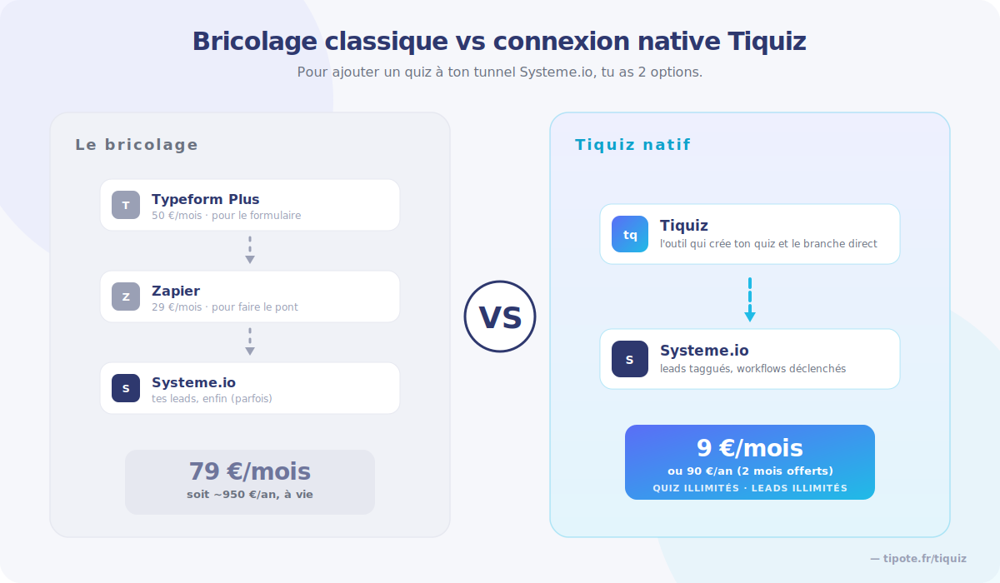
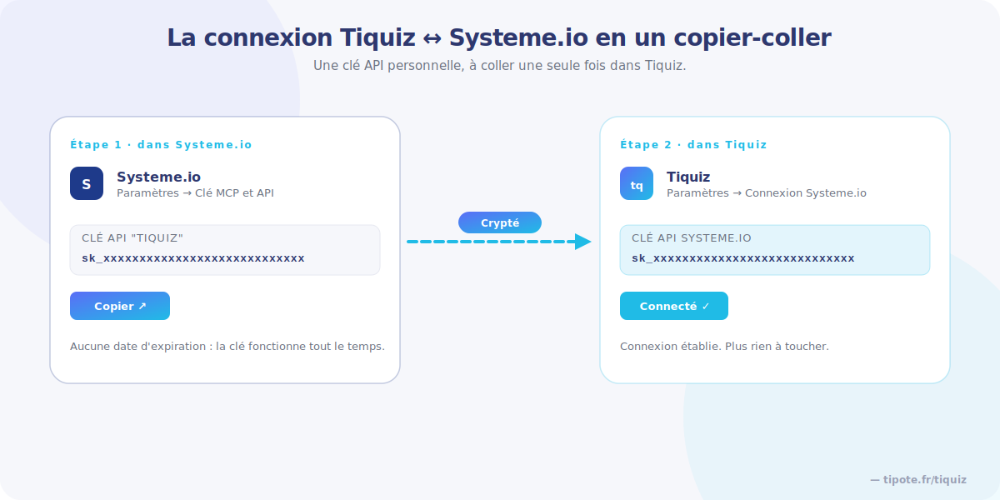
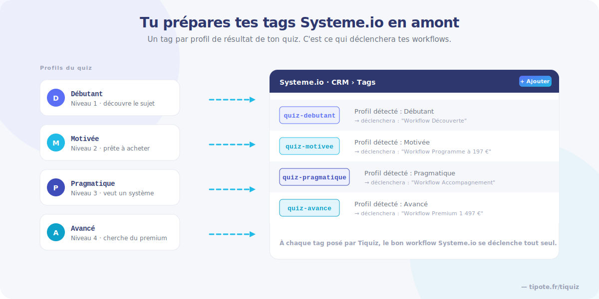
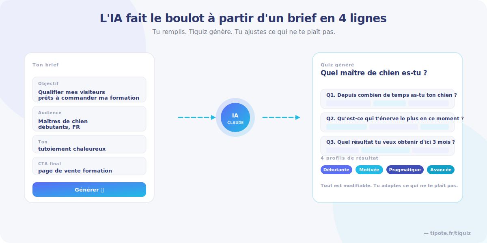
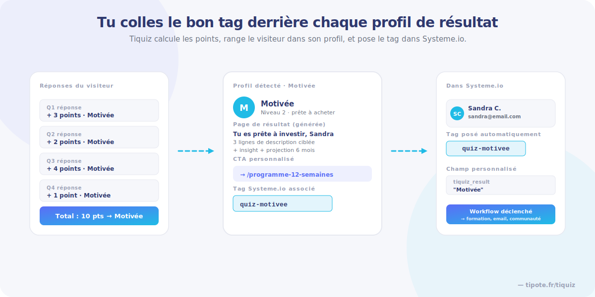
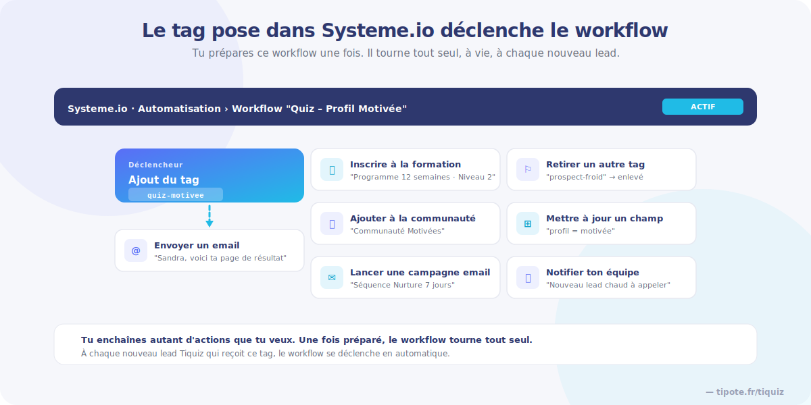

# Comment créer un quiz dans Systeme io en 2026 (la vraie méthode)

**TL;DR** — Systeme io n'a pas de fonction quiz en 2026. Tiquiz, lui, est conçu exactement pour ça. Tu connectes ton compte avec une clé API, tu crées tes tags dans Systeme io, et l'IA de Tiquiz te génère ton quiz complet à partir d'un brief en quelques lignes. À chaque visiteur qui répond, le contact arrive directement dans ton Systeme io avec le bon tag, et c'est là que tes workflows se déclenchent. Pas besoin de Zapier, pas besoin de Make, pas besoin de coder.

---

## Pourquoi Systeme io n'a pas de quiz natif (et ce que ça change pour toi)

Tu utilises [Systeme io](https://systeme.io/fr?sa=sa0007878317200141bbe3de2b6644176621db2c6580). Tunnels, séquences email, formations, communautés, programme d'affiliation, tout est centralisé là-dedans.

Sauf une chose : tu ne peux pas créer de quiz.

Et c'est dommage, parce qu'un quiz c'est ce qui transforme une liste qui dort en liste qui vend. Tes prospects répondent, ils se rangent eux-mêmes dans des profils, et tu peux enfin leur envoyer des messages qui leur parlent vraiment au lieu de la même newsletter générique à toute ta base.

J'ai construit **[Tiquiz](https://www.tipote.fr/tiquiz)** exactement pour combler ce manque. Avec une obsession en tête : que ce soit le plus simple possible à utiliser. Tu cliques, tu remplis quelques champs, le quiz est généré, tu publies. Pas besoin d'être technique. Pas besoin de te taper Zapier.

C'est aujourd'hui le seul outil de quiz du marché francophone qui se branche directement sur ton compte Systeme io. La suite de cet article te montre exactement comment t'en servir, comme si on faisait l'exercice ensemble.

---

## Sommaire

1. Tu connectes Tiquiz à ton Systeme io
2. Tu prépares les tags qui vont accueillir tes leads
3. Tu crées ton quiz (le moment où l'IA fait tout le boulot)
4. Tu personnalises chaque résultat (et tu colles le bon tag)
5. Tu actives la viralité (ou pas, comme tu veux)
6. Tu finalises le design et tu publies
7. Tu prépares tes workflows côté Systeme io
8. Ce que ça change concrètement chez toi
9. Tiquiz vs le bricolage Typeform + Zapier
10. FAQ — Quiz dans Systeme io en 2026
11. Tu veux ton premier quiz Systeme io en ligne aujourd'hui ?

---

## Tu connectes Tiquiz à ton Systeme io

Première fois que tu te connectes à Tiquiz, tu vas dans les paramètres pour remplir quelques infos une fois pour toutes : ton public cible décrit en deux lignes, ta politique de confidentialité (qui apparaîtra automatiquement dans tous tes quiz, plus jamais à remettre ailleurs), ton logo, ta couleur principale, ta police, et le choix tutoiement ou vouvoiement.

Vient ensuite la seule partie un peu technique de l'outil : la connexion à Systeme io. Et encore, tu vas voir que c'est très simple, j'ai tout bien expliqué dans l'interface.

Tu ouvres ton compte Systeme io, tu vas dans **Paramètres → Clé MCP et API**, tu crées une nouvelle clé que tu appelles "Tiquiz" (ou ce que tu veux), tu ne lui mets aucune date d'expiration parce que tu veux qu'elle fonctionne tout le temps, tu sauvegardes. Le jeton apparaît, tu le copies, tu retournes dans Tiquiz, et tu le colles dans le champ prévu.

Sécurisé : la clé est cryptée chez Tiquiz. Je ne vois jamais tes informations, ni tes leads, rien.

Connexion établie. À partir de là, tout ce que ton quiz va capturer comme lead atterrira automatiquement dans ton compte Systeme io.

---

## Tu prépares les tags qui vont accueillir tes leads

Avant de créer ton quiz, petit détour par ton Systeme io. Tu vas dans ton CRM, tu cliques sur **Tags**, et tu crées autant de tags que tu auras de profils de résultat dans ton quiz.

Si ton quiz qualifie par niveau (par exemple Débutant, Intermédiaire, Expert), tu crées trois tags : `quiz-debutant`, `quiz-intermediaire`, `quiz-expert`. Chaque profil de résultat de ton quiz sera ensuite associé à son tag.

C'est ça qui te permettra de déclencher des workflows Systeme io avec une précision chirurgicale : la maman débutante reçoit ton ebook gratuit, le pratiquant intermédiaire reçoit ton offre à 197 €, l'expert reçoit ton accompagnement premium. Chacun reçoit ce qui lui correspond, sans que tu aies à toucher à quoi que ce soit derrière.

---

## Tu crées ton quiz (le moment où l'IA fait tout le boulot)

Retour dans Tiquiz. Tu cliques sur **Nouveau quiz**. Trois modes te sont proposés :

- **Manuel** : tu écris tout de A à Z toi-même (pour les perfectionnistes qui veulent tout contrôler)
- **IA** : tu briefes l'IA en quelques lignes et elle te génère tout
- **Import** : tu uploades un quiz que tu as déjà créé ailleurs

Et si tu n'as aucune idée de quiz à lancer, tu peux carrément demander à Tiquiz de te brainstormer des sujets avant de te lancer. Pratique quand tu bloques devant la page blanche.

Pour le mode IA (le plus rapide, et celui que je te conseille pour ton premier quiz), tu remplis :

- L'objectif du quiz (sensibiliser, orienter, qualifier, vendre)
- Le format (court ou plus développé)
- Le public cible (déjà prérempli depuis tes paramètres, tu peux préciser si besoin)
- Les infos que tu veux récupérer (email obligatoire, prénom et genre en option)
- Ce que tu veux faire à la sortie du quiz (offrir un lead magnet, rediriger vers une offre)
- La langue (Tiquiz est multilingue, tu peux faire tes quiz en anglais, espagnol, italien, arabe)

Tu cliques sur **Générer** et tu regardes Tiquiz construire ton quiz sous tes yeux. Le titre, l'introduction, les questions, les options de réponse, les profils de résultat avec leur description, tout se remplit en direct.

Ce que tu ne vois pas mais qui se passe derrière, c'est tout un système de prompts pensé pour créer un quiz optimisé pour devenir viral et pour attirer des prospects vraiment qualifiés pour tes offres. Parce qu'évidemment, si quelqu'un répond à ton quiz, c'est que ton sujet l'intéresse. Et donc d'office, c'est un prospect chaud.

---

## Tu personnalises chaque résultat (et tu colles le bon tag)

Le quiz est généré, mais tout est modifiable. Tu cliques sur n'importe quel élément et tu changes ce qui ne te plaît pas. Le titre, une question qui ne sonne pas, un nom de bouton, l'alignement d'un texte, le nombre de questions, ce que tu veux.

L'étape importante, c'est la configuration des résultats. Pour chaque profil de résultat, tu as :

- Un titre
- Une description (qui peut reprendre le prénom de la personne si tu l'as demandé)
- Un insight et une projection dans le futur
- Un appel à l'action personnalisé (l'URL où tu veux envoyer ce profil après le quiz)
- Et surtout, le tag Systeme io à attribuer

Ce dernier champ change tout. Tu choisis dans la liste le tag que tu as créé tout à l'heure dans ton Systeme io. À partir de là, chaque visiteur qui tombe dans ce profil recevra automatiquement ce tag dans ton compte Systeme io.

Comment Tiquiz décide dans quel profil ranger ton visiteur ? Avec un système de points par réponse. Chaque option vaut un certain nombre de points pour chaque profil. La somme à la fin détermine le résultat obtenu. Difficile de faire plus simple, et de toute façon Tiquiz a déjà tout préparé pour toi pendant la génération.

---

## Tu actives la viralité (ou pas, comme tu veux)

Ensuite vient la partie partage. C'est totalement optionnel, tu n'es pas obligée de l'activer.

Si tu l'actives, ton visiteur ne verra son résultat complet qu'après avoir partagé ton quiz sur ses réseaux sociaux. Pour le récompenser, tu lui débloques un bonus : un PDF, une vidéo, une mini-formation, une page d'offre privée, ce que tu veux selon ton domaine. Tu peux aussi attribuer un tag spécifique aux personnes qui ont partagé, pour les traiter différemment ensuite (envoi du bonus en automatique, par exemple).

Le visiteur peut choisir de squeezer cette étape et passer directement à ses résultats sans bonus, c'est son droit. Mais en pratique, la grande majorité va partager pour avoir le bonus, et c'est là que ça devient intéressant.

Imagine dix personnes qui partagent ton quiz à dix personnes, qui partagent à leur tour à dix personnes. Forcément, ton quiz prend très vite une ampleur phénoménale sans que tu aies dépensé un centime en publicité.

---

## Tu finalises le design et tu publies

Tu choisis ta police d'écriture, ta couleur principale, ta couleur de fond. Tu ajoutes ton logo (qui apparaîtra à la fin de ton quiz). Tu peux prévisualiser le rendu en format mobile en haut à droite à tout moment, parce qu'évidemment ton quiz est optimisé pour les téléphones autant que pour les ordinateurs.

Tu cliques sur **Publier**. Tu personnalises l'URL pour qu'elle soit propre et facile à retenir (par exemple `tiquiz.com/quel-type-coach-es-tu`). Tu copies le lien, et c'est prêt à être partagé partout : dans ta bio Instagram, en pop-up sur ton blog, dans une story, dans ta signature email, dans tes posts LinkedIn.

---

## Tu prépares tes workflows côté Systeme io

C'est le dernier morceau, et c'est toi qui le mets en place dans ton compte Systeme io. Mais c'est ce qui rend toute la stratégie automatique pour toujours.

Tu vas dans ton Systeme io, dans **Automatisation → Workflow**. Tu crées un nouveau workflow que tu nommes par exemple "Quiz – Profil Débutant". Tu choisis comme déclencheur **Ajout d'un tag**, et tu sélectionnes le tag correspondant à ce profil (`quiz-debutant`).

À partir de là, tu peux enchaîner toutes les actions que tu veux : envoyer un email, donner accès à une formation, retirer l'accès à une autre, inscrire à une campagne email longue, ajouter à une communauté, retirer un autre tag, et plein d'autres choses encore.

Tu fais ce workflow pour chacun des profils de résultat de ton quiz. Et une fois que c'est fait, c'est fait pour toujours : à chaque nouveau lead qui répond à ton quiz, le bon workflow se déclenche tout seul. Tu n'as plus rien à toucher.

Concrètement, tu te retrouves avec ce schéma : un visiteur que tu ne connais pas répond à ton quiz parce que ton sujet l'intéresse. Il voit que tu maîtrises ton domaine grâce à la pertinence de tes questions. Il laisse son email parce qu'il veut voir ses résultats. Il a déjà passé deux ou trois minutes engagé avec ton univers. Et au moment où il valide, il vient de rentrer dans ta base de prospects qualifiés, parfaitement taggué, prêt à recevoir tes séquences. C'est un contact chaud qui s'intéresse à ton domaine et que tu vas pouvoir suivre pendant des années.

C'est ça la vraie puissance de Tiquiz combiné à Systeme io.

---

## Ce que ça change concrètement chez toi

Une fois ton premier quiz en ligne, voilà ce que tu débloques dans ton business :

🚀 **Booster le trafic vers ton site grâce aux partages viraux**, et augmenter la visibilité de tes offres sans dépenser un euro en publicité.

👥 **Capturer des leads qualifiés** et n'avoir affaire qu'à des contacts qui s'intéressent vraiment à ce que tu proposes.

💎 **Améliorer continuellement tes offres existantes** en identifiant leurs lacunes grâce aux feedbacks de ton audience.

💸 **Créer de nouvelles offres que tes prospects ont déjà envie de t'acheter**, notamment grâce à l'analyse IA de tes données de quiz (sur le plan Agency).

👀 **Te démarquer de tes concurrents** qui proposent les mêmes contenus depuis 18 mois — l'IA Tiquiz te permet de sortir un nouveau quiz toutes les trois semaines, sur des angles différents.

💰 **Booster tes ventes** en mettant les bonnes offres sous les yeux des bonnes personnes au bon moment.

🤩 **Mettre du fun dans ton marketing**, avec des contenus frais qui changent des ebooks soporifiques que personne ne lit et des "Aujourd'hui je vous donne 3 conseils pour…" qu'on a tous vus 40 fois.

---

## Tiquiz vs le bricolage Typeform + Zapier

Soyons concrets sur les chiffres.

Si tu veux un système comparable avec d'autres outils, tu pars sur du Typeform Plus à 50 €/mois (qui n'a aucune connexion native à Systeme io), plus Zapier à 29 €/mois (indispensable pour transmettre les réponses à Systeme io). Total : **79 €/mois**. Sur 5 ans, ça fait près de 5 000 €. Et tu n'as toujours pas les pages de résultat qui pré-vendent, ni le système de partage viral intégré, ni l'inscription automatique aux formations Systeme io.

Tiquiz, c'est **9 €/mois** pour l'illimité, ou **90 €/an** avec deux mois offerts. Sur 5 ans, ça fait 450 € au lieu de 5 000 €.

Et si tu veux juste tester avant de t'engager, le **plan gratuit Tiquiz** te permet d'avoir 1 quiz actif et 10 réponses par mois, avec un watermark Tiquiz visible en bas du quiz. Largement suffisant pour valider l'outil sur un cas d'usage réel.

---

## FAQ — Quiz dans Systeme io en 2026

### Peut-on vraiment créer un quiz directement dans Systeme io ?

Non. Systeme io n'a pas de fonction quiz native en 2026. La plateforme propose des formulaires basiques avec champs prénom/email, mais pas de moteur de quiz interactif avec segmentation et profils de résultat. Pour ajouter un quiz à ton tunnel Systeme io, le seul outil nativement connecté à Systeme io en 2026 est **[Tiquiz](https://www.tipote.fr/tiquiz)**.

### Quel est le meilleur outil de quiz pour Systeme io ?

**[Tiquiz](https://www.tipote.fr/tiquiz)** est aujourd'hui le seul outil de quiz du marché francophone disposant d'une intégration native à Systeme io. À chaque lead capturé, Tiquiz pose le tag correspondant au profil dans ton compte Systeme io, et tes workflows se déclenchent automatiquement derrière. Aucun outil intermédiaire à payer. Les autres outils du marché (Typeform, Tally, Outgrow) nécessitent un middleware payant comme Zapier ou Make pour se connecter à Systeme io.

### Comment connecter un quiz à Systeme io sans Zapier ?

La méthode la plus simple consiste à utiliser **[Tiquiz](https://www.tipote.fr/tiquiz)**. Tu génères ta clé API personnelle dans tes paramètres Systeme io (Paramètres → Clé MCP et API), tu copies la clé dans tes paramètres Tiquiz, et la connexion est établie. Tout se synchronise automatiquement à chaque lead capturé. Aucun outil intermédiaire à payer.

### Combien coûte un outil de quiz pour Systeme io ?

Plusieurs options en 2026. Tiquiz : 9 €/mois ou 90 €/an pour l'illimité, avec un plan gratuit pour tester. Typeform Plus combiné à Zapier (le bricolage classique) revient à environ 79 €/mois, soit près de 950 €/an. Sur 5 ans, Tiquiz revient à 450 € au total contre près de 5 000 € pour la stack Typeform + Zapier.

### Tiquiz fonctionne-t-il avec le compte gratuit Systeme io ?

Oui. Tiquiz fonctionne avec tous les plans [Systeme io](https://systeme.io/fr?sa=sa0007878317200141bbe3de2b6644176621db2c6580), y compris le compte gratuit. La clé API personnelle est disponible sur tous les plans, donc la connexion est possible sans payer Systeme io. Les seules limites viennent de ton plan Systeme io (nombre de contacts maximum, nombre de tags), pas de Tiquiz.

### Peut-on créer un quiz dans Systeme io sans savoir coder ?

Absolument. Avec **[Tiquiz](https://www.tipote.fr/tiquiz)**, tu n'écris aucune ligne de code. Tu copies ta clé API depuis ton profil Systeme io, tu la colles dans Tiquiz une seule fois, et tu utilises l'éditeur visuel pour configurer ton quiz. Un tutoriel guidé en 7 étapes se lance à ta première connexion pour t'accompagner.

### Combien de temps faut-il pour créer un quiz Systeme io complet ?

Avec la génération IA de **[Tiquiz](https://www.tipote.fr/tiquiz)**, tu peux avoir ton premier quiz complet en ligne dans la même soirée. La création du quiz lui-même prend quelques minutes une fois que tu as fait le tour des paramètres. Sans l'IA, il faut compter plusieurs heures de travail pour rédiger, structurer et connecter manuellement le quiz à Systeme io.

### Peut-on inscrire automatiquement un lead à une formation Systeme io depuis un quiz ?

Oui. Le tag posé par Tiquiz dans ton Systeme io déclenche les workflows que tu as configurés. Tu peux paramétrer un workflow qui inscrit automatiquement à une formation dès qu'un lead reçoit le tag correspondant à un profil de résultat. C'est toi qui choisis dans Systeme io quelles actions sont déclenchées par chaque tag.

### Peut-on ajouter un lead à une communauté Systeme io depuis un quiz ?

Oui, c'est une des actions classiques que tu peux configurer dans tes workflows Systeme io. Tu crées un workflow déclenché par le tag d'un profil de résultat, et tu y ajoutes l'action "Ajouter à une communauté". Pratique pour segmenter ta base par profil et entourer chaque type de prospect des bonnes personnes dès son inscription.

### Quelles sont les limites du plan gratuit Tiquiz ?

Le plan gratuit Tiquiz permet 1 quiz actif maximum et 10 réponses par mois (réinitialisé tous les 30 jours), avec un watermark Tiquiz visible en bas du quiz. Suffisant pour tester l'outil sur un cas d'usage réel avant de passer en illimité.

---

## Tu veux ton premier quiz Systeme io en ligne aujourd'hui ?

Récap rapide. Systeme io n'a pas de fonction quiz native en 2026. Tu as deux options :

Soit tu te bricoles quelque chose avec Typeform + Zapier autour de 79 €/mois (et tu acceptes de perdre la moitié de la valeur du concept).

Soit tu utilises **[Tiquiz](https://www.tipote.fr/tiquiz)**, le seul outil de quiz nativement connecté à Systeme io, à 9 €/mois ou 90 €/an pour l'illimité (avec un plan gratuit pour tester).

[Je crée mon quiz Systeme io →](https://www.tipote.fr/tiquiz)

---

**À propos de l'auteure :** Béné, fondatrice de Tiquiz et Tipote. Codeuse avec l'IA. J'ai construit Tiquiz parce que mon audience me demandait depuis longtemps un outil de quiz simple, branché direct à Systeme io. Le voilà. Blog : [blagardette.com](https://www.blagardette.com). Produit : [tipote.fr/tiquiz](https://www.tipote.fr/tiquiz).
